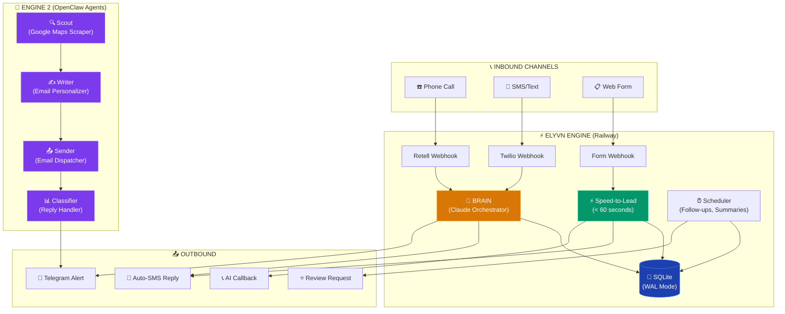
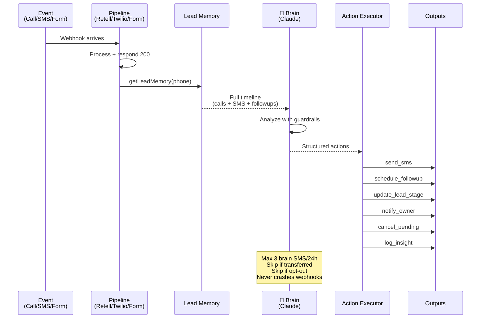
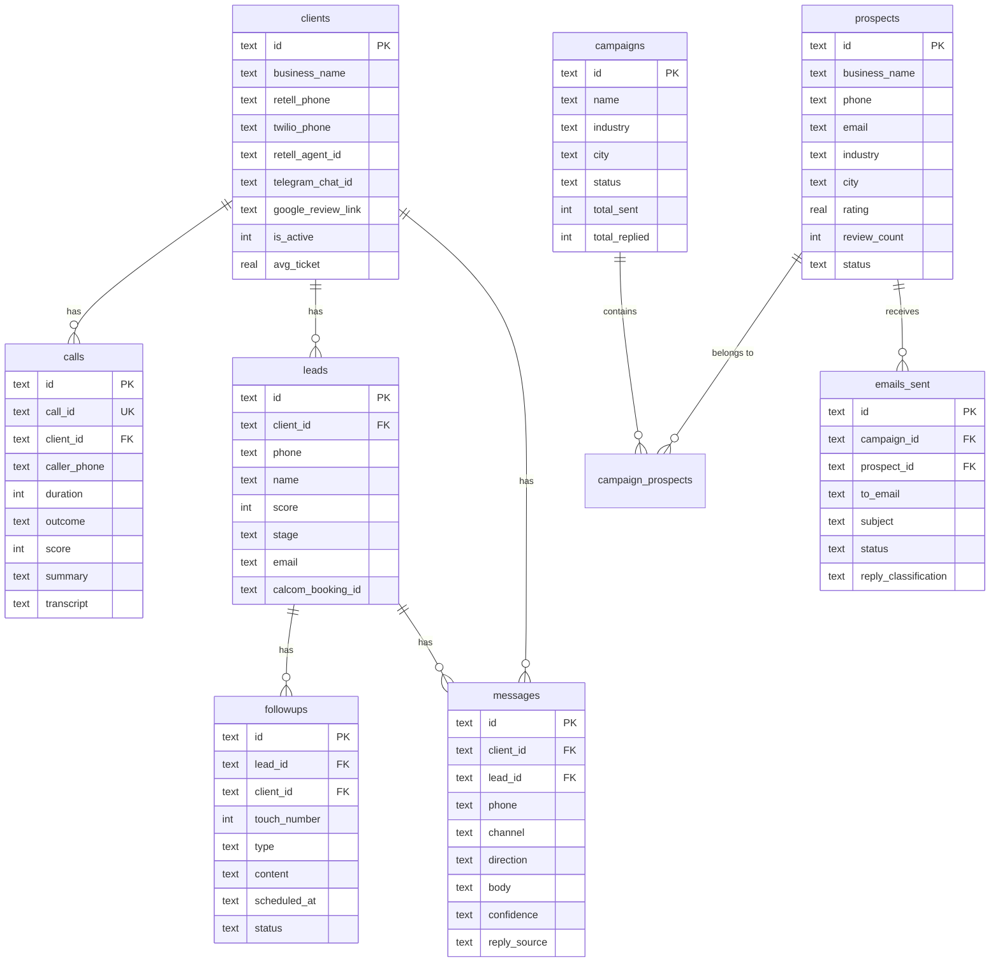

<div align="center">


<br/>


<br/><br/>

[](https://joyful-trust-production.up.railway.app/health)
[]()
[]()
[]()
[]()
[]()

<br/>

```
 ██████╗ ██╗     ██╗   ██╗██╗   ██╗███╗   ██╗
██╔════╝ ██║     ╚██╗ ██╔╝██║   ██║████╗  ██║
█████╗   ██║      ╚████╔╝ ██║   ██║██╔██╗ ██║
██╔══╝   ██║       ╚██╔╝  ╚██╗ ██╔╝██║╚██╗██║
███████╗ ███████╗   ██║    ╚████╔╝ ██║ ╚████║
╚══════╝ ╚══════╝   ╚═╝    ╚═══╝  ╚═╝  ╚═══╝
```

**AI operations platform for service businesses.**<br/>
Answers every call. Replies to every text. Books every appointment. Markets itself while you sleep.

<br/>

[Live Dashboard](https://joyful-trust-production.up.railway.app) · [Health Check](https://joyful-trust-production.up.railway.app/health) · [API Docs](#api-endpoints)

</div>

---

## How It Works

<div align="center">



</div>

---

## Features

<table>
<tr>
<td width="50%">

### Engine 1 — AI Operations


- **AI Call Answering** — Retell handles calls with custom knowledge base, scores leads 1-10, summarizes every call
- **SMS Auto-Reply** — Claude generates contextual replies using business knowledge base, with confidence scoring and escalation
- **Speed-to-Lead** — Triple-touch: instant SMS (0s) → AI callback (60s) → follow-up SMS (5min) → 24h/72h nurture
- **Missed Call Text-Back** — Instant SMS when a call is missed, voicemail, or abandoned
- **Web Form Capture** — Universal webhook accepts any form builder (WordPress, Typeform, Wix, Squarespace, custom)
- **Appointment Reminders** — Automated SMS reminders before booked appointments
- **Review Automation** — `/complete` marks job done → review request SMS sent 2 hours later
- **Cross-Channel Brain** — Sees call + SMS + form history for each lead, makes autonomous decisions

</td>
<td width="50%">

### Engine 2 — Self-Marketing


- **Scout Agent** — Scrapes Google Maps for service businesses (plumbers, HVAC, auto repair, dentists, electricians) across 20 US cities
- **Writer Agent** — Generates personalized cold emails using business data (rating, reviews, industry miss rates)
- **Sender Agent** — Dispatches 30 emails/day via Gmail SMTP with 2-min delays (anti-spam safe)
- **Classifier Agent** — Monitors inbox every 30 min, classifies replies (INTERESTED/QUESTION/DECLINE/UNSUBSCRIBE), auto-responds
- **Telegram Alerts** — Hot replies flagged instantly to owner's Telegram
- **CAN-SPAM Compliant** — Real sender, unsubscribe in every email, bounced/unsubscribed contacts never re-emailed

</td>
</tr>
</table>

---

## The Brain

<div align="center">



</div>

Every event (call, SMS, form) fires the brain. It sees the full lead history across all channels and decides what to do next. If a customer called yesterday and texts today, the brain recognizes the cross-channel pattern and responds accordingly.

**Available Actions:**
| Action | What it does |
|--------|-------------|
| `send_sms` | Send SMS via Twilio (logged as `reply_source: 'brain'`) |
| `schedule_followup` | Insert into followups table with timing + content |
| `cancel_pending_followups` | Cancel all pending followups for this lead |
| `update_lead_stage` | Move lead through: `new → contacted → hot → booked → completed → lost` |
| `update_lead_score` | Adjust score 1-10 based on engagement signals |
| `notify_owner` | Send Telegram alert to business owner |
| `log_insight` | Record brain's reasoning for audit trail |
| `no_action` | Explicitly decide to do nothing (logged) |

---

## Speed-to-Lead Engine

<div align="center">

```
Customer submits form / misses call
         │
         ▼
    ┌─────────┐
    │  0 sec   │──→ 📱 Instant SMS with booking link
    └────┬────┘
         │
         ▼
    ┌─────────┐
    │  60 sec  │──→ 📞 AI callback via Retell (if not booked)
    └────┬────┘
         │
         ▼
    ┌─────────┐
    │  5 min   │──→ 📱 Follow-up SMS (if not booked)
    └────┬────┘
         │
         ▼
    ┌─────────┐
    │  24 hr   │──→ 📱 Nurture SMS via brain
    └────┬────┘
         │
         ▼
    ┌─────────┐
    │  72 hr   │──→ 📱 Final nudge via brain
    └─────────┘
```


</div>

---

## Architecture

<div align="center">

```
┌──────────────────────────────────────────────────────────────────────┐
│                        RAILWAY (Production)                          │
│                                                                      │
│  ┌─────────────────────────┐    ┌──────────────────────────────┐    │
│  │    Bridge (Node.js)     │    │     MCP Server (Python)      │    │
│  │    Port 3001            │    │     Port 8000                │    │
│  │                         │    │                              │    │
│  │  /webhooks/retell    ───┤    │  FastMCP 3.1.1               │    │
│  │  /webhooks/twilio    ───┤    │  Tools: voice, messaging,    │    │
│  │  /webhooks/telegram  ───┤    │  followup, booking,          │    │
│  │  /webhooks/form      ───┤    │  intelligence, reporting,    │    │
│  │  /api/*              ───┤    │  scraper, outreach,          │    │
│  │                         │    │  reply_handler               │    │
│  │  Utils:                 │    │                              │    │
│  │  ├── brain.js           │    │  Knowledge Bases:            │    │
│  │  ├── leadMemory.js      │    │  └── 2 loaded                │    │
│  │  ├── actionExecutor.js  │    │                              │    │
│  │  ├── speed-to-lead.js   │    └──────────────────────────────┘    │
│  │  ├── scheduler.js       │                                        │
│  │  ├── sms.js             │    ┌──────────────────────────────┐    │
│  │  ├── telegram.js        │    │     SQLite (/data/elyvn.db)  │    │
│  │  └── calcom.js          │    │     WAL mode | busy_timeout  │    │
│  └─────────────────────────┘    │     10 tables | 6 indexes    │    │
│                                  └──────────────────────────────┘    │
│  ┌─────────────────────────┐                                        │
│  │  Dashboard (React/Vite) │    Volume: /data (persistent)          │
│  │  Served from /public    │    Health: GET /health                  │
│  └─────────────────────────┘    Rate limit: 120 req/min/IP          │
└──────────────────────────────────────────────────────────────────────┘

┌──────────────────────────────────────────────────────────────────────┐
│                     LOCAL MAC (OpenClaw Agents)                       │
│                                                                      │
│  ┌──────────┐  ┌──────────┐  ┌──────────┐  ┌──────────────────┐    │
│  │  Scout   │  │  Writer  │  │  Sender  │  │    Classifier    │    │
│  │  8 AM    │  │  8:30 AM │  │  10 AM   │  │    Every 30 min  │    │
│  │          │  │          │  │  Mon-Sat  │  │                  │    │
│  │  Scrape  │→│  Draft   │→│  Send    │→│  Classify+Reply  │    │
│  │  50/day  │  │  emails  │  │  30/day  │  │  Auto-respond    │    │
│  └──────────┘  └──────────┘  └──────────┘  └──────────────────┘    │
│                                                                      │
│  Shared: ~/elyvn-agents/shared/                                      │
│  ├── prospects.json    (scraped businesses)                          │
│  ├── emails-queue.json (drafted/sent emails)                         │
│  ├── config.json       (industries, cities, limits)                  │
│  └── send-email.js     (SMTP helper)                                 │
└──────────────────────────────────────────────────────────────────────┘
```

</div>

**Two processes on Railway (concurrent via `concurrently`):**

| Process | Runtime | Port | Purpose |
|---------|---------|------|---------|
| Bridge | Node.js 22 (Express) | 3001 | Webhooks, API, Telegram, brain, scheduler |
| MCP Server | Python 3.12 (FastMCP) | 8000 | AI tools, DB init, knowledge bases |

**Four agents on local Mac (OpenClaw cron):**

| Agent | Schedule (IST) | Purpose |
|-------|---------------|---------|
| Scout | 8:00 AM daily | Scrape Google Maps for prospects |
| Writer | 8:30 AM daily | Draft personalized cold emails |
| Sender | 10:00 AM Mon-Sat | Send 30 emails with 2-min gaps |
| Classifier | Every 30 min | Check inbox, classify replies, auto-respond |

---

## Project Structure

```
elyvn/
├── server/
│   ├── bridge/                       # Node.js Express server
│   │   ├── index.js                  # Entry, middleware, routes, DB migrations
│   │   ├── routes/
│   │   │   ├── retell.js             # call_started, call_ended, call_analyzed, transfer
│   │   │   ├── twilio.js             # SMS auto-reply, CANCEL/YES keywords, brain
│   │   │   ├── telegram.js           # 15 bot commands + callback buttons
│   │   │   ├── forms.js              # Universal form webhook (CF7, Typeform, generic)
│   │   │   ├── api.js                # REST API (clients, calls, leads, messages)
│   │   │   └── outreach.js           # Engine 2 campaign management
│   │   ├── utils/
│   │   │   ├── brain.js              # Claude orchestrator (configurable model)
│   │   │   ├── leadMemory.js         # Cross-channel lead timeline builder
│   │   │   ├── actionExecutor.js     # Executes brain decisions
│   │   │   ├── speed-to-lead.js      # Triple-touch sequence engine
│   │   │   ├── sms.js                # Twilio SMS with rate limiting
│   │   │   ├── telegram.js           # Bot API + notification formatters
│   │   │   ├── scheduler.js          # Cron: summary, report, followups, outreach
│   │   │   ├── calcom.js             # Cal.com booking integration
│   │   │   ├── scraper.js            # Google Maps Places API scraper
│   │   │   ├── emailGenerator.js     # Claude cold email generator
│   │   │   ├── emailSender.js        # Nodemailer SMTP with daily limits
│   │   │   └── replyClassifier.js    # Claude reply classifier
│   │   └── public/                   # Built dashboard + embed.js
│   ├── mcp/                          # Python FastMCP server
│   │   ├── main.py                   # MCP entry, tool registration
│   │   ├── db.py                     # SQLite schema (aiosqlite)
│   │   ├── clients.py                # Knowledge base loader
│   │   ├── knowledge_bases/          # Client KB files (JSON)
│   │   └── tools/                    # 8 MCP tool modules
│   └── requirements.txt
├── dashboard/                        # React + Vite (builds to bridge/public/)
├── tests/
│   └── hypergrade.js                 # 71-test production suite
├── Dockerfile                        # Python 3.12 + Node 22
├── railway.toml                      # Railway deployment config
└── package.json                      # Root scripts

~/elyvn-agents/                       # OpenClaw agent workspace (local)
├── agents/
│   ├── scout/     (SOUL.md + run.sh)
│   ├── writer/    (SOUL.md + run.sh)
│   ├── sender/    (SOUL.md + run.sh)
│   └── classifier/(SOUL.md + run.sh)
├── shared/        (config, data, helpers)
├── .env           (credentials)
└── HEARTBEAT.md   (schedule + guardrails)

~/elyvn-openclaw/                     # OpenClaw agent definitions
├── scout/SOUL.md
├── writer/SOUL.md
├── sender/SOUL.md
└── classifier/SOUL.md
```

---

## Database Schema

SQLite with WAL mode, `busy_timeout = 5000`, `foreign_keys = ON`. Six indexes on hot columns.



---

## Event Flows

### Inbound Call

```
☎️ Retell webhook → POST /webhooks/retell
│
├─ call_started
│  └─ Insert call record, match client by phone or agent_id
│
├─ call_ended
│  ├─ 1. Fetch transcript from Retell API (fallback: webhook payload)
│  ├─ 2. Generate summary (from transcript or call_analysis.call_summary)
│  ├─ 3. Score lead 1-10 via Claude
│  ├─ 4. Determine outcome (booked/transferred/missed/voicemail/info)
│  ├─ 5. Upsert lead record
│  ├─ 6. Schedule follow-up sequence
│  ├─ 7. Missed → speed-to-lead (instant text-back + 60s AI callback)
│  ├─ 8. Transfer/complaint → SMS to owner
│  ├─ 9. Telegram notification (with transcript button)
│  └─ 10. BRAIN fires → analyze history → execute actions
│
├─ call_analyzed
│  └─ Backfill transcript + summary if missing
│
└─ agent_transfer / dtmf(*)
   └─ Live transfer to owner's phone
```

### Inbound SMS

```
💬 Twilio webhook → POST /webhooks/twilio
│
├─ "CANCEL" → Cancel Cal.com booking
├─ "YES"    → Send booking link
│
└─ Normal message:
   ├─ 1. Check is_active (paused → log only, notify owner)
   ├─ 2. Rate limit (5-min cooldown per number)
   ├─ 3. Load knowledge base for this client
   ├─ 4. Claude generates reply {reply, confidence}
   ├─ 5. Low confidence → generic reply + escalate to owner
   ├─ 6. Upsert lead, log inbound + outbound
   ├─ 7. New lead → schedule nudge followup
   ├─ 8. Telegram notification
   └─ 9. BRAIN fires → cross-channel analysis → actions
```

### Form Submission

```
📋 POST /webhooks/form/:clientId
│
├─ Parse field names (CF7, Typeform, Wix, generic)
├─ Normalize phone (10-digit → +1, 11-digit, parens, dashes)
│
├─ No phone → email-only lead + Telegram notify
│
└─ With phone:
   ├─ Upsert lead
   ├─ Log inbound message
   ├─ Trigger speed-to-lead (0s SMS → 60s callback → 5min SMS)
   └─ BRAIN fires → analyze → actions
```

---

## Scheduled Tasks

| Task | Interval | Description |
|------|----------|-------------|
| Follow-up Processor | Every 5 min | Process due followups through the brain |
| Daily Summary | 7:00 PM IST | Telegram: today's calls, bookings, messages, revenue |
| Weekly Report | Monday 8 AM | Telegram: weekly performance + persist to DB |
| Daily Lead Review | 9:00 AM | Brain reviews stale leads (inactive 2+ days, score >= 5) |
| Daily Outreach | 10:00 AM | Engine 2: send campaign emails via server-side pipeline |
| Reply Checker | Every 30 min | IMAP inbox scan for cold email replies |

---

## Telegram Commands

<div align="center">

| Command | Description |
|---------|-------------|
| `/start` | Connect account via onboarding link |
| `/today` | Today's booked appointments |
| `/stats` | Last 7 days: calls, bookings, missed, messages, revenue |
| `/calls` | Last 5 calls with outcome, score, summary |
| `/leads` | Hot leads (score >= 7, not completed/lost) |
| `/brain` | Last 10 autonomous brain decisions |
| `/pause` | Pause AI (calls ring through, SMS logged only) |
| `/resume` | Resume AI answering |
| `/complete +phone` | Mark job done → review request in 2 hours |
| `/setreview URL` | Set Google review link for the business |
| `/outreach` | Engine 2 campaign stats |
| `/scrape industry city` | Manually trigger Google Maps scrape |
| `/prospects` | View latest scraped prospects |
| `/help` | Show all commands |

</div>

**Callback buttons:** Full transcript (call cards), Good reply / I'll handle this (SMS cards).

---

## Embed Widget

Drop this on any website to capture leads:

```html
<form id="elyvn-form">
  <input name="name" placeholder="Name" required>
  <input name="phone" placeholder="Phone" required>
  <textarea name="message" placeholder="How can we help?"></textarea>
  <button type="submit">Send</button>
</form>
<script src="https://joyful-trust-production.up.railway.app/embed.js"
        data-client-id="YOUR_CLIENT_ID"></script>
```

Works with any HTML page. No dependencies. Auto-submits to the form webhook.

---

## Environment Variables

| Variable | Required | Description |
|----------|----------|-------------|
| `ANTHROPIC_API_KEY` | Yes | Claude API (brain, SMS, scoring, summaries) |
| `RETELL_API_KEY` | Yes | Retell API (call transcripts) |
| `TWILIO_ACCOUNT_SID` | Yes | Twilio SID |
| `TWILIO_AUTH_TOKEN` | Yes | Twilio auth |
| `TWILIO_PHONE_NUMBER` | Yes | Twilio number (e.g. +13612139099) |
| `TELEGRAM_BOT_TOKEN` | Yes | Telegram bot token |
| `TELEGRAM_WEBHOOK_SECRET` | Yes | Webhook verification secret |
| `DATABASE_PATH` | No | SQLite path (default: Railway `/data/elyvn.db`) |
| `CLAUDE_MODEL` | No | Model override (default: `claude-sonnet-4-20250514`, switch to `claude-haiku-4-5-20251001` to cut costs 12x) |
| `CALCOM_API_KEY` | No | Cal.com booking management |
| `GOOGLE_MAPS_API_KEY` | No | Google Maps scraping |
| `SMTP_USER` | No | Gmail for outreach |
| `SMTP_PASS` | No | Gmail app password |
| `ELYVN_API_KEY` | No | API auth (open if unset) |
| `PORT` | No | Server port (default: 3001) |

---

## Webhook URLs

| Service | URL |
|---------|-----|
| Retell | `https://joyful-trust-production.up.railway.app/webhooks/retell` |
| Twilio SMS | `https://joyful-trust-production.up.railway.app/webhooks/twilio` |
| Telegram | `https://joyful-trust-production.up.railway.app/webhooks/telegram` |
| Web Forms | `https://joyful-trust-production.up.railway.app/webhooks/form/:clientId` |

---

## API Endpoints

All `/api` routes require `x-api-key` header when `ELYVN_API_KEY` is set.

| Method | Path | Description |
|--------|------|-------------|
| `GET` | `/health` | DB counts, env vars, memory, uptime |
| `GET` | `/api/clients` | List all clients |
| `POST` | `/api/clients` | Create client |
| `PUT` | `/api/clients/:id` | Update client |
| `GET` | `/api/calls` | List calls (`client_id`, `limit`, `offset`) |
| `GET` | `/api/leads` | List leads |
| `GET` | `/api/messages` | List messages |
| `GET` | `/api/followups` | List followups (`status` filter) |
| `POST` | `/api/outreach/campaigns` | Create outreach campaign |
| `POST` | `/api/outreach/scrape` | Trigger Google Maps scrape |

---

## Deployment

```bash
# Local development
npm run dev          # MCP + Bridge + Dashboard (Vite dev server)

# Production build
npm run build        # Dashboard → server/bridge/public/

# Deploy
git push origin main # Auto-deploy (if connected)
railway up --detach  # Manual deploy
```

**Dockerfile:** Python 3.12 base → Node 22 → npm install → Vite build → `npm start`

**Railway:**
- Health check: `GET /health`
- Restart: on_failure (max 3)
- Volume: `/data` (persistent SQLite)
- Region: US West

---

## Testing

```bash
# Full production test suite (71 tests)
BASE_URL=https://joyful-trust-production.up.railway.app node tests/hypergrade.js
```

Tests cover:
- Server infrastructure (health, SPA routing, rate limiting, JSON errors)
- Retell pipeline (call_started, call_ended, call_analyzed, unknown events)
- Missed call text-back (duration 0, voicemail, no_answer)
- SMS auto-reply + brain (normal, cross-channel, escalation, empty, missing fields)
- Speed-to-lead (form → triple-touch)
- Web form capture (standard, CF7, 10-digit normalize, email-only, empty, bad client, URL-encoded, body client_id)
- Telegram commands (all 15 + photo + callback + auth)
- Concurrency stress (10 calls, 15 SMS, 5 forms simultaneously)
- Malformed input attacks (SQL injection, XSS, 50KB payload, emoji flood, null bytes, negative duration, array, deep nesting)
- Full E2E flow (call → SMS → form → /complete → /brain)
- Agent squad file verification
- Embed script loading
- API auth

---

## Production Hardening

- `unhandledRejection` + `uncaughtException` handlers (process stays alive)
- Every route wrapped in try-catch
- Express error middleware (400 for bad JSON, not 500)
- SQLite WAL mode + 5s busy_timeout + 6 indexes
- Rate limiting: 120 req/min/IP
- SMS rate limiting: 5-min cooldown/number + max 3 brain SMS/24h
- API key auth on `/api` routes
- Telegram webhook secret verification
- Brain errors never crash webhooks
- `sendMessage` checks `res.ok` and logs failures
- Graceful shutdown: `SIGINT`/`SIGTERM` close DB

---

## Post-Max Survival

When Claude Max expires, one env var change keeps everything running:

```bash
# On Railway — switch model (12x cheaper)
CLAUDE_MODEL=claude-haiku-4-5-20251001
```

| Item | Cost |
|------|------|
| Railway | $5/mo |
| Claude Haiku API | $5-15/mo |
| OpenClaw agents (NVIDIA free tier) | $0/mo |
| Twilio/Retell (client pass-through) | $0 |
| **Total** | **$10-20/mo** |

---

<div align="center">


<br/><br/>

[](https://github.com/sweetsinai/elyvn)

</div>
