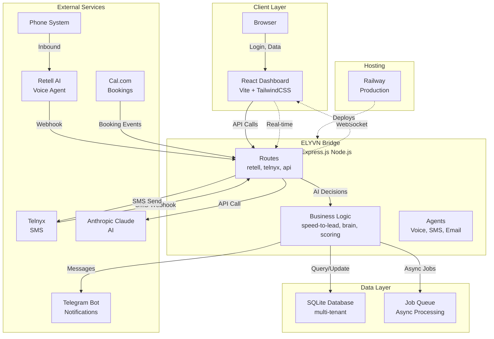
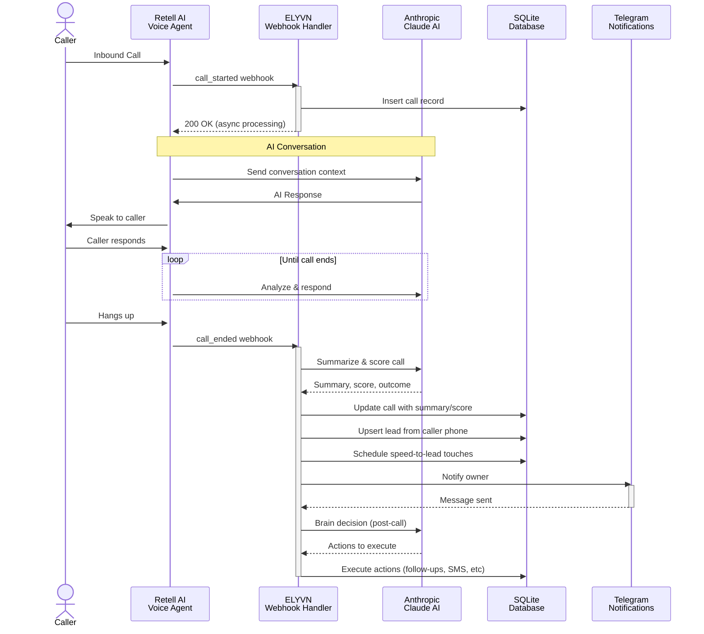
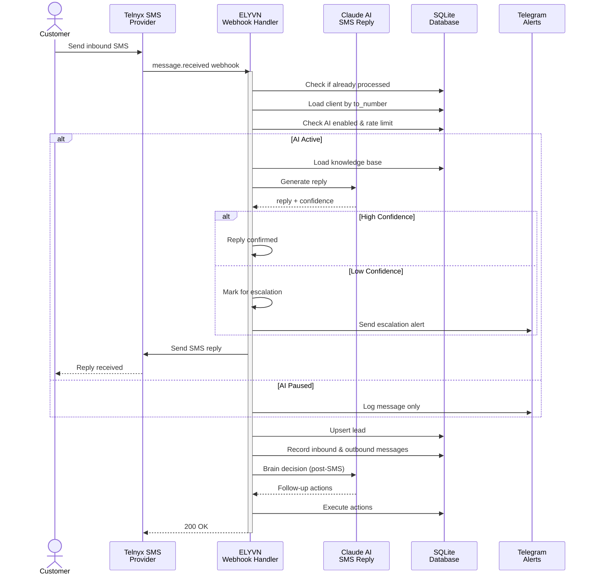
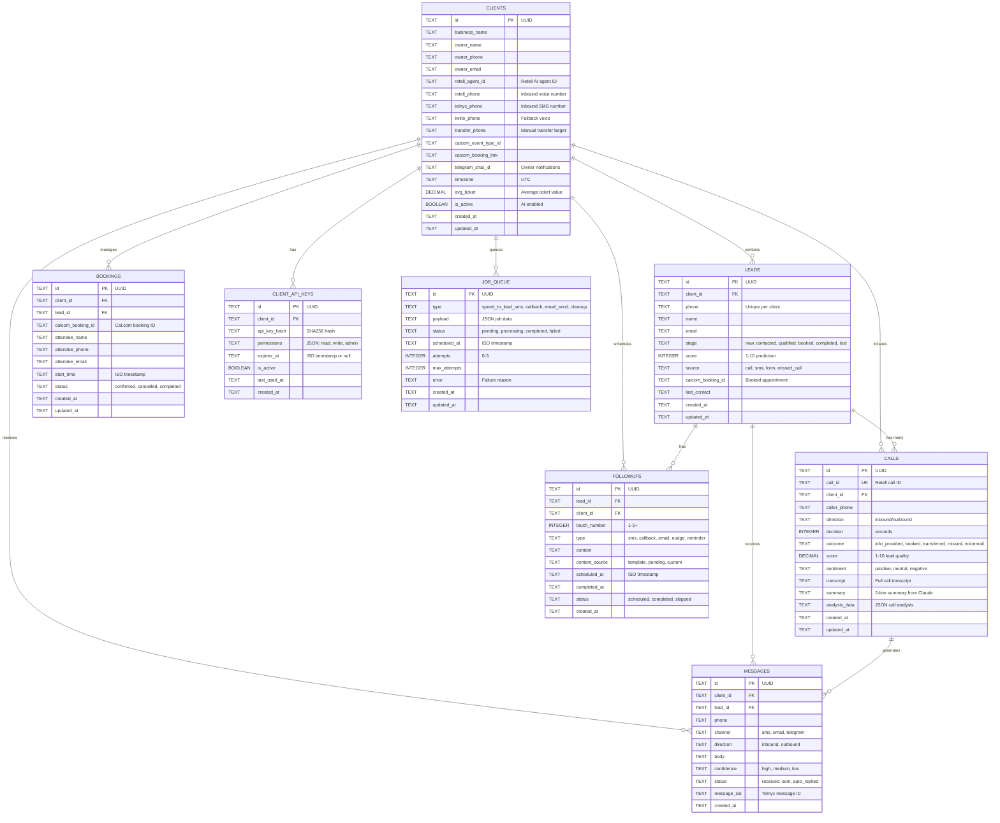
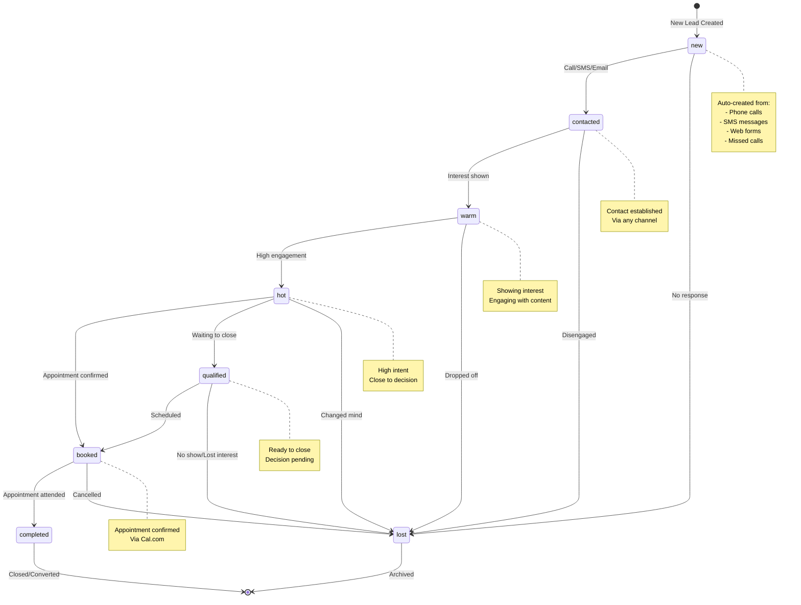

# ELYVN

> **AI-Powered Sales Automation Platform** — Voice calls, SMS, lead management, appointments, and real-time analytics in one unified system.

[](https://nodejs.org)
[](LICENSE)
[](https://expressjs.com)
[](https://react.dev)
[](https://sqlite.org)
[](https://railway.app)

---

## Overview

**ELYVN** is a multi-tenant AI-powered sales automation platform that transforms customer interactions into actionable insights. It seamlessly integrates voice calls, SMS, appointment booking, and email outreach into a single intelligent system powered by Anthropic's Claude AI.

### Core Features

- **Inbound Voice Calls** — AI agents handle calls via Retell AI with real-time transcription & sentiment analysis
- **SMS Conversations** — Claude-powered SMS replies with confidence scoring and escalation
- **Lead Management** — Automatic lead creation, scoring, and pipeline stage tracking
- **Speed-to-Lead** — Instant multi-touch sequences (SMS → callback → follow-ups)
- **Appointment Booking** — Integrated Cal.com bookings with cancellation support
- **Real-Time Notifications** — Telegram alerts for missed calls, transfers, complaints
- **Autonomous Brain** — AI makes post-interaction decisions and executes follow-up actions
- **Advanced Analytics** — Conversation intelligence, peak hours, response time impact, ROI metrics

---

## Architecture



---

## Call Flow Diagram



---

## SMS Flow Diagram



---

## Database Schema (ER Diagram)



---

## Lead Pipeline Diagram



---

## Dashboard Pages

The dashboard provides 11 main pages for multi-tenant management:

| Page | Description |
|------|-------------|
| **Dashboard** | Real-time KPIs: calls this week, messages, bookings, revenue estimate, leads by stage |
| **Calls** | Searchable call log with transcripts, outcomes, scores, sentiment analysis, download capabilities |
| **Messages** | SMS conversation thread view with inbound/outbound history and AI confidence scores |
| **Pipeline** | Visual lead stage funnel, drag-to-update stages, predictive scoring, conversion analytics |
| **Intelligence** | Conversation intelligence: peak hours, average response time, sentiment trends, quality metrics |
| **Outreach** | Cold email campaigns via Engine 2: Google Maps scraping, SMTP sending, reply tracking via IMAP |
| **Bookings** | Cal.com integration: upcoming appointments, attendee details, cancellation handling |
| **Clients** | Multi-tenant client management: create, edit, configure integrations (Retell, Telnyx, Cal.com) |
| **ClientDetail** | Detailed client view: knowledge base management, business settings, phone number configuration |
| **Provision** | API key management: create per-client keys, set permissions, manage expiration |
| **Settings** | Global admin settings: business profile, notification preferences, integrations, logout |

---

## Tech Stack

### Backend
- **Runtime** — Node.js 18+
- **Framework** — Express.js 4.21
- **Database** — SQLite 3 (better-sqlite3) — embedded, fast, multi-tenant
- **AI** — Anthropic Claude API (claude-sonnet-4-20250514)
- **Voice** — Retell AI (inbound calls, transcription, sentiment)
- **SMS** — Telnyx (inbound/outbound SMS with Ed25519 signature verification)
- **Scheduling** — Cal.com (appointment booking, cancellations)
- **Notifications** — Telegram Bot API
- **Email** — Nodemailer + Node-IMAP (Engine 2 cold outreach)

### Frontend
- **Framework** — React 19 + JSX
- **Build Tool** — Vite 5 (ultra-fast development & production builds)
- **Styling** — TailwindCSS
- **Routing** — React Router v6
- **HTTP** — Native fetch API (no axios dependency)
- **Icons** — Lucide React

### Hosting & DevOps
- **Deployment** — Railway.app (push-to-deploy from Git)
- **Monitoring** — Sentry (optional error tracking)
- **Version Control** — Git

---

## Environment Variables

All environment variables are defined in `.env.example`. Here's a complete reference:

### Core Configuration
| Variable | Required | Description |
|----------|----------|-------------|
| `NODE_ENV` | No | `development` or `production` |
| `PORT` | No | Express server port (default: 3001) |
| `DATABASE_PATH` | No | SQLite database file path (default: ./elyvn.db) |

### Security
| Variable | Required | Description |
|----------|----------|-------------|
| `ELYVN_API_KEY` | Yes (prod) | Global API key protecting all endpoints & dashboard login |
| `CORS_ORIGINS` | No | Comma-separated allowed origins (e.g., `https://yourdomain.com`) |

### AI & Language Model
| Variable | Required | Description |
|----------|----------|-------------|
| `ANTHROPIC_API_KEY` | **Yes** | Anthropic API key for Claude AI (voice summaries, SMS replies, brain decisions) |
| `CLAUDE_MODEL` | No | Claude model ID (default: `claude-sonnet-4-20250514`) |

### Voice Integration
| Variable | Required | Description |
|----------|----------|-------------|
| `RETELL_API_KEY` | No (optional) | Retell AI API key for voice agent features |
| `RETELL_WEBHOOK_SECRET` | No | Secret for HMAC-SHA256 webhook signature verification |

### SMS Integration
| Variable | Required | Description |
|----------|----------|-------------|
| `TELNYX_API_KEY` | No (optional) | Telnyx API key for SMS sending |
| `TELNYX_PHONE_NUMBER` | No | Inbound/outbound SMS phone number |
| `TELNYX_MESSAGING_PROFILE_ID` | No | Telnyx messaging profile ID |
| `TELNYX_PUBLIC_KEY` | No | Public key for Ed25519 webhook signature verification |

### Appointment Booking
| Variable | Required | Description |
|----------|----------|-------------|
| `CALCOM_API_KEY` | No (optional) | Cal.com API key for booking integration |
| `CALCOM_EVENT_TYPE_ID` | No | Cal.com event type ID for default scheduling |
| `CALCOM_BOOKING_LINK` | No | Cal.com public booking link for SMS/email |
| `MY_CALCOM_LINK` | No | Creator's personal Cal.com link (for Engine 2 prospects) |

### Notifications
| Variable | Required | Description |
|----------|----------|-------------|
| `TELEGRAM_BOT_TOKEN` | No (optional) | Telegram bot token for owner notifications |
| `TELEGRAM_WEBHOOK_SECRET` | No | Secret for Telegram webhook signature verification |

### Email Outreach (Engine 2)
| Variable | Required | Description |
|----------|----------|-------------|
| `SMTP_HOST` | No | SMTP server hostname (default: `smtp.gmail.com`) |
| `SMTP_PORT` | No | SMTP port (default: `587`) |
| `SMTP_USER` | No | SMTP username/email |
| `SMTP_PASS` | No | SMTP password or app-specific password |
| `SMTP_FROM_NAME` | No | Sender display name (default: `Sohan from ELYVN`) |

### Email Reply Tracking (Engine 2)
| Variable | Required | Description |
|----------|----------|-------------|
| `IMAP_HOST` | No | IMAP server hostname (default: `imap.gmail.com`) |
| `IMAP_PORT` | No | IMAP port (default: `993`) |
| `IMAP_USER` | No | IMAP username/email (same as SMTP_USER) |
| `IMAP_PASS` | No | IMAP password (same as SMTP_PASS) |

### Lead Generation (Engine 2)
| Variable | Required | Description |
|----------|----------|-------------|
| `GOOGLE_MAPS_API_KEY` | No | Google Maps API key for prospect scraping |

### Compliance
| Variable | Required | Description |
|----------|----------|-------------|
| `BUSINESS_ADDRESS` | No (optional) | Physical mailing address (required by CAN-SPAM for cold emails) |

### Monitoring & Error Tracking
| Variable | Required | Description |
|----------|----------|-------------|
| `SENTRY_DSN` | No | Sentry error tracking DSN (free tier available) |

---

## Quick Start

### Prerequisites
- Node.js 18+ (check: `node --version`)
- npm or yarn
- SQLite (included with better-sqlite3)

### Installation

```bash
# Clone the repository
git clone https://github.com/yourusername/elyvn.git
cd elyvn

# Install dependencies
npm install

# Copy environment template and configure
cp .env.example .env

# Edit .env with your API keys
nano .env

# Start development server
cd server/bridge
npm run dev

# In another terminal, start the dashboard
cd dashboard
npm run dev

# Open http://localhost:5173 in your browser
```

### Production Deployment

```bash
# On Railway.app, set environment variables via dashboard
# Then deploy with a single git push

git push origin main

# Railway automatically builds and deploys:
# - Installs dependencies
# - Runs production build
# - Starts Express server on PORT=3001
# - Serves React dashboard from /public
```

---

## API Endpoints

### Webhooks (No Auth Required)
```
POST /webhooks/retell          - Retell AI call events
POST /webhooks/telnyx          - Telnyx SMS events
POST /webhooks/calcom          - Cal.com booking events
POST /webhooks/telegram        - Telegram message events
POST /webhooks/form            - Web form submissions
```

### Public APIs
```
GET  /health                   - Health check
POST /api/onboard/register     - Client registration
```

### Authenticated APIs (Require `x-api-key` header)
```
GET  /api/stats/:clientId      - Weekly KPIs
GET  /api/calls/:clientId      - Call history (paginated)
GET  /api/messages/:clientId   - SMS history (paginated)
GET  /api/leads/:clientId      - Lead pipeline (paginated)
PUT  /api/leads/:clientId/:leadId - Update lead stage
GET  /api/bookings/:clientId   - Upcoming appointments
POST /api/clients              - Create new client
PUT  /api/clients/:clientId    - Update client settings
POST /api/chat                 - Stream chat with Claude
GET  /api/intelligence/:clientId - Conversation intelligence report
GET  /api/revenue/:clientId    - ROI metrics
GET  /api/schedule/:clientId   - Daily contact schedule
```

---

## Deployment

### Railway.app (Recommended)

1. **Connect Repository**
   ```bash
   railway connect  # Link your GitHub repo
   ```

2. **Set Environment Variables**
   - Go to Railway dashboard → Settings → Environment
   - Add all required variables from `.env.example`
   - Important: Set `ELYVN_API_KEY` to a strong random string

3. **Deploy**
   ```bash
   git push origin main
   ```
   Railway automatically detects `package.json`, installs dependencies, and starts the server.

4. **Configure Domain**
   - Railway assigns a public URL (e.g., `https://elyvn-prod.up.railway.app`)
   - Go to Settings → Networking → Custom Domain to use your own domain
   - Update `CORS_ORIGINS` to match your domain

5. **Monitor Logs**
   ```bash
   railway logs
   ```

### Local Development with Docker (Optional)

```bash
docker build -t elyvn .
docker run -p 3001:3001 --env-file .env elyvn
```

---

## Features Deep Dive

### Voice Calls (Retell AI)
- **Inbound calls** to dedicated phone number ring Retell AI agent
- **Real-time transcription** and sentiment analysis
- **Claude summarizes** calls in 2 lines with 1-10 quality score
- **Automatic lead creation** from caller phone number
- **Speed-to-lead sequence**: SMS → callback → follow-up emails
- **Transfer to human** on demand (DTMF * or agent transfer)
- **Voicemail detection** with smart callback scheduling

### SMS Conversations (Telnyx)
- **Inbound SMS** automatically generate leads
- **Claude AI replies** using client knowledge base
- **Confidence scoring**: high/medium/low confidence responses
- **Low-confidence escalation** to owner via Telegram
- **TCPA compliance**: automatic STOP/UNSUBSCRIBE handling
- **5-minute rate limiting** per phone number
- **Opt-out tracking**: SMS_opt_outs table

### Lead Management
- **Auto-scoring**: 1-10 scale from call/SMS/booking interactions
- **Stage pipeline**: new → contacted → qualified → booked → completed
- **Recent interactions**: last 3 calls & messages per lead
- **Predictive scoring**: ML model predicts close probability
- **Batch operations**: Update multiple leads at once

### Speed-to-Lead Sequences
Triggered on any lead creation (call, SMS, form, missed call):
1. **Touch 1 (0s)**: SMS with booking link
2. **Touch 2 (60s)**: AI callback via Retell
3. **Touch 3 (5min)**: Follow-up SMS if no booking
4. **Touch 4 (24h)**: Reminder/nudge SMS
5. **Touch 5 (72h)**: Final follow-up SMS

### Autonomous Brain
Post-call and post-SMS, the system asks Claude:
- Should we send a follow-up? When?
- Should we update the lead stage?
- Should we schedule a callback?
- Should we escalate to the owner?

Claude makes decisions autonomously based on:
- Lead memory (previous interactions)
- Conversation sentiment
- Booking status
- Client business hours

### Real-Time Dashboard
- **WebSocket updates** for new calls, messages, bookings
- **Live call notifications** with transcript & score
- **SMS alerts** for escalations
- **Telegram integration** for offline notifications

---

## Architecture Highlights

### Multi-Tenant Isolation
- Each client is isolated by UUID
- API key permissions prevent cross-tenant access
- SQL queries always filter by `client_id`
- Webhook handlers validate client ownership

### Database Optimization
- **Indexes** on frequently queried columns: client_id, phone, created_at
- **Transactions** for atomic lead upserts
- **Prepared statements** prevent SQL injection
- **WAL mode** for concurrent read/write

### Error Handling & Resilience
- **Circuit breakers** for external API failures
- **Retry logic** with exponential backoff (3 attempts)
- **Graceful degradation**: SMS sends async via job queue
- **Unhandled rejection handlers** prevent silent crashes
- **Sentry integration** for production error tracking

### Security
- **Webhook signature verification**: HMAC-SHA256 (Retell), Ed25519 (Telnyx)
- **Timing-safe comparison** prevents timing attacks
- **Rate limiting**: 120 requests/minute per IP (LRU map)
- **Helmet.js** security headers
- **CORS validation**: whitelist allowed origins
- **API key hashing**: SHA256 stored in DB, compared timing-safe

---

## Monitoring & Debugging

### Health Check Endpoint
```bash
curl https://yourdomain/health
```

Returns: uptime, memory usage, database counts, configured services.

### View Logs
```bash
# Development
npm run dev  # Logs to console

# Production (Railway)
railway logs
```

### Database Inspection
```bash
# Open SQLite browser
sqlite3 ./elyvn.db

# Query examples
sqlite> SELECT COUNT(*) FROM calls;
sqlite> SELECT * FROM leads WHERE client_id = 'xxx' LIMIT 10;
sqlite> SELECT * FROM job_queue WHERE status = 'failed';
```

### Test API
```bash
# Health check
curl https://yourdomain/health

# Get calls (requires API key)
curl -H "x-api-key: YOUR_API_KEY" \
  https://yourdomain/api/calls/CLIENT_ID
```

---

## Contributing

Contributions welcome! Please:

1. Fork the repository
2. Create a feature branch (`git checkout -b feature/your-feature`)
3. Commit changes (`git commit -am 'Add feature'`)
4. Push to branch (`git push origin feature/your-feature`)
5. Open a Pull Request

---

## License

MIT © 2024

---

## Support & Contact

For questions or support:
- GitHub Issues: [Report a bug](https://github.com/yourusername/elyvn/issues)
- Documentation: Check `/docs` folder
- Email: support@elyvn.net

---

## Roadmap

- [ ] WhatsApp integration
- [ ] Advanced lead scoring with ML
- [ ] Multi-language SMS support
- [ ] Custom AI agent personas
- [ ] Zapier/Make integration
- [ ] Advanced analytics dashboards
- [ ] Voice agent customization UI
- [ ] A/B testing for sequences

---

**Built with** ❤️ **by the ELYVN team**
