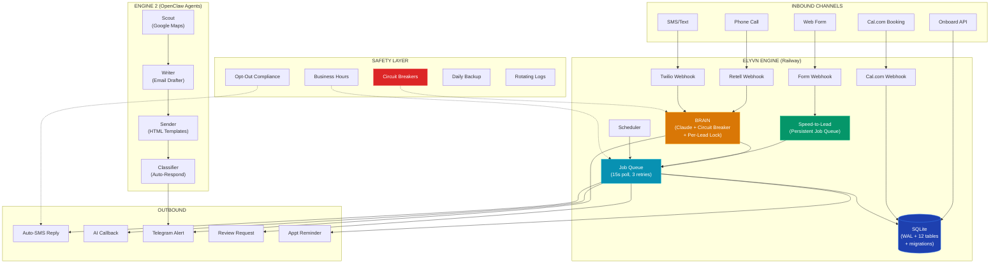
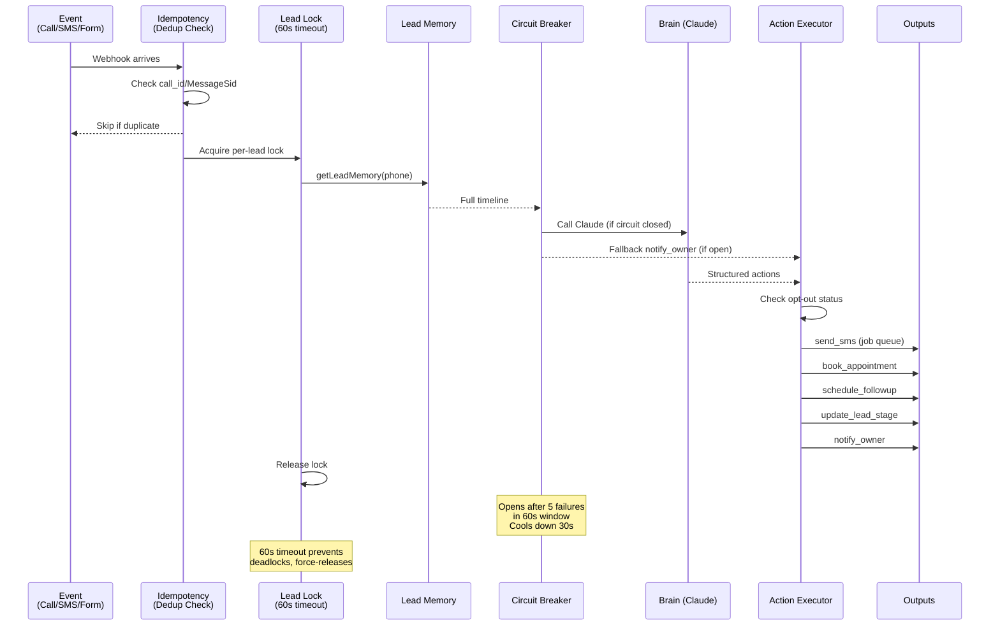

<div align="center">


<br/>


<br/><br/>

[](https://joyful-trust-production.up.railway.app/health)
[]()
[]()
[]()
[]()
[]()
[](https://github.com/sweetsinai/elyvn/actions)
[]()

<br/>

```
 ██████╗ ██╗     ██╗   ██╗██╗   ██╗███╗   ██╗
██╔════╝ ██║     ╚██╗ ██╔╝██║   ██║████╗  ██║
█████╗   ██║      ╚████╔╝ ██║   ██║██╔██╗ ██║
██╔══╝   ██║       ╚██╔╝  ╚██╗ ██╔╝██║╚██╗██║
███████╗ ███████╗   ██║    ╚████╔╝ ██║ ╚████║
╚══════╝ ╚══════╝   ╚═╝    ╚═══╝  ╚═╝  ╚═══╝
```

**AI operations platform for service businesses.**<br/>
Answers every call. Replies to every text. Books every appointment. Markets itself while you sleep.

<br/>

[Live Server](https://joyful-trust-production.up.railway.app) · [Health Check](https://joyful-trust-production.up.railway.app/health) · [API Docs](#api-endpoints) · [Onboarding API](ONBOARDING_API.md) · [Quick Start](QUICK_START.md)

</div>

---

## How It Works

<div align="center">



</div>

---

## Features

<table>
<tr>
<td width="50%">

### Engine 1 — AI Operations


- **AI Call Answering** — Retell handles calls with custom KB, scores leads 1-10, summarizes every call
- **SMS Auto-Reply** — Claude generates contextual replies with confidence scoring + escalation
- **Speed-to-Lead** — Persistent job queue: SMS (0s) → AI callback (60s) → follow-up (5min) → nurture (24h/72h)
- **Missed Call Text-Back** — Instant SMS when missed or abandoned
- **Voicemail Handling** — Text-back + next-business-hour callback scheduling
- **Web Form Capture** — Universal webhook (WordPress, Typeform, Wix, Squarespace, custom)
- **Cal.com Webhooks** — Booking created/cancelled/rescheduled auto-updates leads + Telegram
- **Appointment Reminders** — Job queue integrated SMS reminders
- **Review Automation** — `/complete` → cancel reminders → review request in 2h
- **Cross-Channel Brain** — Per-lead mutex lock, circuit breaker, `book_appointment` action
- **Client Onboarding** — `POST /api/onboard` — atomic client creation + KB generation

</td>
<td width="50%">

### Engine 2 — Self-Marketing


- **Scout Agent** — Google Maps scraper across 20 US cities, 5 industries
- **Writer Agent** — Claude-personalized cold emails using business data
- **Sender Agent** — HTML email templates, List-Unsubscribe headers, bounce detection
- **Classifier Agent** — Auto-classify replies + full INTERESTED conversion sequence
- **INTERESTED Flow** — Auto-reply with booking link + SMS + Telegram alert + 24h follow-up job
- **No-Reply Follow-up** — Day 3 follow-up via job queue for non-responders
- **Auto-Classify Endpoint** — `POST /auto-classify` for batch processing
- **CAN-SPAM Compliant** — Unsubscribe headers, bounced contacts blacklisted

### Engine 3 — Intelligence & Analytics

- **Predictive Lead Scoring** — Weighted 0-100 score: responsiveness (25%), engagement (25%), intent (20%), recency (15%), channel diversity (15%)
- **Conversation Intelligence** — Pattern analysis, coaching tips, response time impact on conversion
- **Revenue Attribution** — Multi-touch attribution chain, per-channel ROI, pipeline value tracking
- **Smart Scheduler** — AI-powered optimal contact times, time slot success analysis, prioritized daily contact lists
- **Peak Hours Analysis** — Activity heatmap with hour-by-hour breakdown for staffing optimization
- **Conversion Funnel Analytics** — Stage-by-stage conversion rates with dropout analysis

### Production Safety & Security

- **Per-Client API Key Auth** — SHA256 hashed keys, client isolation middleware prevents cross-client data access
- **Circuit Breakers** — Claude API (5 fails → 30s cooldown), Retell API
- **Bounded Rate Limiter** — LRU eviction (max 10K entries), per-IP rate limit headers
- **Input Validation** — Centralized validators for UUID, phone, email, stage, actions
- **Audit Logging** — All auth events logged with IP, user agent, timestamp
- **Data Retention** — Automated cleanup (30/90/180 day policies)
- **Graceful Shutdown** — SIGTERM/SIGINT → drain connections → WAL checkpoint → close (10s timeout)
- **Database Abstraction** — SQLite→PostgreSQL migration path via single env var
- **WebSocket** — Real-time dashboard updates
- **Sentry Integration** — Error monitoring with PII scrubbing
- **210 Unit Tests** — 12 test suites, Jest + in-memory SQLite
- **CI/CD Pipeline** — GitHub Actions: test, lint, security audit, build check
- **SMS Opt-Out** — STOP/UNSUBSCRIBE/QUIT/END + re-opt-in (START)
- **Business Hours** — Delays sends until client's configured open hours
- **Persistent Job Queue** — Survives restarts, 3 retries, 15s polling
- **Daily Backups** — SQLite WAL checkpoint + file copy

</td>
</tr>
</table>

---

## The Brain

<div align="center">



</div>

**Available Actions:**
| Action | What it does |
|--------|-------------|
| `send_sms` | SMS via Twilio (checks opt-out first, via job queue) |
| `book_appointment` | Create Cal.com booking (start_time, service, email, phone) |
| `schedule_followup` | Insert followup with timing + content |
| `cancel_pending_followups` | Cancel all pending followups for this lead |
| `update_lead_stage` | `new → contacted → warm → hot → booked → completed → lost → nurture` |
| `update_lead_score` | Score 1-10 with reason |
| `notify_owner` | Telegram alert with urgency level (low/medium/high/critical) |
| `log_insight` | Record brain reasoning for audit trail |
| `no_action` | Explicitly do nothing (logged) |

---

## Speed-to-Lead Engine

<div align="center">

```
Customer submits form / misses call / voicemail
         │
         ▼
    ┌─────────┐    ┌──────────────────────────────────┐
    │  0 sec   │──→ │ SMS with booking link              │──→ Job Queue
    └────┬────┘    │ (business hours aware)              │
         │         └──────────────────────────────────┘
         ▼
    ┌─────────┐    ┌──────────────────────────────────┐
    │  60 sec  │──→ │ AI callback via Retell             │──→ Job Queue
    └────┬────┘    │ (re-fetches client, checks stage)  │
         │         └──────────────────────────────────┘
         ▼
    ┌─────────┐    ┌──────────────────────────────────┐
    │  5 min   │──→ │ Follow-up SMS                      │──→ Job Queue
    └────┬────┘    │ (skips if booked/completed)         │
         │         └──────────────────────────────────┘
         ▼
    ┌─────────┐
    │  24 hr   │──→ Nurture SMS via brain (followups table)
    └────┬────┘
         ▼
    ┌─────────┐
    │  72 hr   │──→ Final nudge via brain
    └─────────┘
```


</div>

---

## Architecture

<div align="center">

```
┌─────────────────────────────────────────────────────────────────────────────┐
│                            RAILWAY (Production)                             │
│                                                                             │
│  ┌──────────────────────────────────┐  ┌──────────────────────────────┐    │
│  │    Bridge (Node.js 22)           │  │   MCP Server (Python 3.12)   │    │
│  │    Port 3001                     │  │   Port 8000                  │    │
│  │                                  │  │                              │    │
│  │  Webhooks:                       │  │   FastMCP 3.1.1              │    │
│  │  ├── /webhooks/retell            │  │   9 tool modules:            │    │
│  │  ├── /webhooks/twilio            │  │   ├── voice.py               │    │
│  │  ├── /webhooks/telegram          │  │   ├── messaging.py           │    │
│  │  ├── /webhooks/form/:clientId    │  │   ├── followup.py            │    │
│  │  ├── /webhooks/calcom            │  │   ├── booking.py             │    │
│  │  └── /api/*                      │  │   ├── intelligence.py        │    │
│  │                                  │  │   ├── reporting.py           │    │
│  │  Core:                           │  │   ├── scraper.py             │    │
│  │  ├── brain.js (circuit breaker)  │  │   ├── outreach.py            │    │
│  │  ├── leadMemory.js (ON CONFLICT) │  │   └── reply_handler.py       │    │
│  │  ├── actionExecutor.js           │  │   All wrapped in try/except  │    │
│  │  ├── speed-to-lead.js (job q)    │  └──────────────────────────────┘    │
│  │  ├── jobQueue.js                 │                                      │
│  │  ├── scheduler.js                │  ┌──────────────────────────────┐    │
│  │  ├── phone.js (centralized)      │  │   SQLite (/data/elyvn.db)    │    │
│  │  ├── sms.js (opt-out aware)      │  │   WAL mode | busy_timeout    │    │
│  │  └── telegram.js                 │  │   12 tables | migrations     │    │
│  │                                  │  │                              │    │
│  │  Safety:                         │  │   Tables:                    │    │
│  │  ├── optOut.js                   │  │   ├── clients, calls, leads  │    │
│  │  ├── businessHours.js            │  │   ├── messages, followups    │    │
│  │  ├── resilience.js (breakers)    │  │   ├── appointments           │    │
│  │  ├── metrics.js                  │  │   ├── job_queue              │    │
│  │  ├── backup.js                   │  │   ├── sms_opt_outs           │    │
│  │  ├── logger.js (rotating)        │  │   ├── prospects, campaigns   │    │
│  │  ├── migrations.js               │  │   ├── campaign_prospects     │    │
│  │  └── emailTemplates.js           │  │   ├── emails_sent            │    │
│  │                                  │  │   └── _migrations            │    │
│  │  Routes:                         │  └──────────────────────────────┘    │
│  │  ├── retell.js (idempotent)      │                                      │
│  │  ├── twilio.js (idempotent)      │  Volume: /data (persistent)          │
│  │  ├── telegram.js (15 commands)   │  Health: GET /health                  │
│  │  ├── forms.js                    │  Metrics: GET /metrics                │
│  │  ├── calcom-webhook.js           │  Rate limit: 120 req/min/IP          │
│  │  ├── onboard.js                  │  Backups: Daily WAL checkpoint        │
│  │  ├── api.js (UUID validated)     │  Logs: 7-day rotating files           │
│  │  └── outreach.js (+auto-classify)│                                      │
│  └──────────────────────────────────┘                                      │
│                                                                             │
│  ┌──────────────────────────────────┐                                      │
│  │  Dashboard (React/Vite)          │                                      │
│  │  LoginGate + ErrorBoundary       │                                      │
│  │  Authenticated API calls         │                                      │
│  └──────────────────────────────────┘                                      │
└─────────────────────────────────────────────────────────────────────────────┘

┌─────────────────────────────────────────────────────────────────────────────┐
│                        LOCAL MAC (OpenClaw Agents)                           │
│                                                                             │
│  ┌──────────┐  ┌──────────┐  ┌──────────┐  ┌──────────────────┐           │
│  │  Scout   │  │  Writer  │  │  Sender  │  │    Classifier    │           │
│  │  8 AM    │  │  8:30 AM │  │  10 AM   │  │    Every 30 min  │           │
│  │  Scrape  │→ │  Draft   │→ │  Send    │→ │  Classify+Reply  │           │
│  │  50/day  │  │  emails  │  │  30/day  │  │  + INTERESTED    │           │
│  │          │  │          │  │  HTML     │  │    conversion    │           │
│  └──────────┘  └──────────┘  └──────────┘  └──────────────────┘           │
└─────────────────────────────────────────────────────────────────────────────┘
```

</div>

---

## Project Structure

```
elyvn/
├── server/
│   ├── bridge/                            # Node.js Express server
│   │   ├── index.js                       # Entry, middleware, routes, env validation
│   │   ├── routes/
│   │   │   ├── retell.js                  # call_started/ended/analyzed, voicemail, idempotent
│   │   │   ├── twilio.js                  # SMS reply, opt-out/opt-in, idempotent
│   │   │   ├── telegram.js                # 15 bot commands + callback buttons
│   │   │   ├── forms.js                   # Universal form webhook
│   │   │   ├── calcom-webhook.js          # Booking created/cancelled/rescheduled
│   │   │   ├── onboard.js                 # POST /api/onboard (atomic)
│   │   │   ├── api.js                     # REST API (UUID validated, async file I/O)
│   │   │   └── outreach.js               # Campaigns, email scraping, auto-classify
│   │   ├── utils/
│   │   │   ├── brain.js                   # Claude orchestrator + circuit breaker + lead lock
│   │   │   ├── leadMemory.js              # Timeline builder (INSERT ON CONFLICT)
│   │   │   ├── actionExecutor.js          # Execute brain decisions (opt-out aware, book_appointment)
│   │   │   ├── speed-to-lead.js           # Job queue powered, business hours aware
│   │   │   ├── jobQueue.js                # Persistent queue (job_queue table, 3 retries)
│   │   │   ├── phone.js                   # Centralized E.164 normalization
│   │   │   ├── sms.js                     # Twilio SMS (opt-out check, retry backoff)
│   │   │   ├── telegram.js                # Bot API + formatters
│   │   │   ├── scheduler.js               # Cron: summary, report, followups, outreach, reminders
│   │   │   ├── calcom.js                  # createBooking, cancelBooking, getAvailability
│   │   │   ├── optOut.js                  # STOP/UNSUBSCRIBE/QUIT/END compliance
│   │   │   ├── businessHours.js           # Per-client delay engine
│   │   │   ├── appointmentReminders.js    # Job queue integrated
│   │   │   ├── resilience.js              # CircuitBreaker + retryWithBackoff
│   │   │   ├── metrics.js                 # recordMetric + /metrics
│   │   │   ├── backup.js                  # Daily WAL checkpoint + copy
│   │   │   ├── logger.js                  # Rotating file logs (7-day)
│   │   │   ├── migrations.js              # Versioned schema (15 migrations, _migrations table)
│   │   │   ├── validators.js              # Centralized input validation (UUID, phone, email, stage)
│   │   │   ├── dbAdapter.js               # Database abstraction (SQLite → PostgreSQL path)
│   │   │   ├── gracefulShutdown.js        # SIGTERM/SIGINT → drain → checkpoint → close
│   │   │   ├── clientIsolation.js         # Per-client data isolation middleware
│   │   │   ├── leadScoring.js             # Predictive lead scoring (0-100, weighted factors)
│   │   │   ├── conversationIntelligence.js # Pattern analysis, coaching tips, peak hours
│   │   │   ├── revenueAttribution.js      # Multi-touch attribution, channel ROI
│   │   │   ├── smartScheduler.js          # Optimal contact times, daily schedule generation
│   │   │   ├── rateLimiter.js             # BoundedRateLimiter with LRU eviction
│   │   │   ├── auditLog.js               # Auth event audit trail
│   │   │   ├── dataRetention.js           # Automated data cleanup (30/90/180 day)
│   │   │   ├── monitoring.js              # Sentry integration + PII scrubbing
│   │   │   ├── websocket.js               # Real-time dashboard updates
│   │   │   ├── emailTemplates.js          # Responsive HTML + CTA wrappers
│   │   │   ├── emailGenerator.js          # Claude cold email generator
│   │   │   ├── emailSender.js             # Nodemailer + bounce detection
│   │   │   └── replyClassifier.js         # Claude reply classifier
│   │   ├── tests/                          # Jest unit tests (12 suites, 210 tests)
│   │   │   ├── phone.test.js              # 15 tests — E.164 normalization
│   │   │   ├── emailVerifier.test.js      # 20 tests — email validation
│   │   │   ├── resilience.test.js         # 14 tests — circuit breaker, retry
│   │   │   ├── jobQueue.test.js           # Job queue enqueue/process/cancel
│   │   │   ├── leadMemory.test.js         # Lead memory building + timeline
│   │   │   ├── brain.test.js              # Brain.think() with mocked Anthropic
│   │   │   ├── actionExecutor.test.js     # Action execution validation
│   │   │   ├── migrations.test.js         # 36 tests — migration system
│   │   │   ├── leadScoring.test.js        # 12 tests — predictive scoring
│   │   │   ├── conversationIntelligence.test.js  # 15 tests
│   │   │   ├── revenueAttribution.test.js # 16 tests — attribution chain
│   │   │   └── smartScheduler.test.js     # 16 tests — scheduling
│   │   └── public/                        # Dashboard build + embed.js
│   ├── mcp/                               # Python FastMCP server
│   │   ├── main.py                        # MCP entry
│   │   ├── db.py                          # SQLite schema
│   │   ├── knowledge_bases/               # Per-client KB (JSON)
│   │   └── tools/                         # 9 modules (all try/except wrapped)
│   └── requirements.txt
├── dashboard/                             # React + Vite
│   └── src/
│       ├── App.jsx                        # Router: 7 pages
│       ├── lib/
│       │   ├── api.js                     # Authenticated API client (20+ endpoints)
│       │   ├── utils.js                   # formatPhone, timeAgo, buildQueryString
│       │   └── useWebSocket.js            # Real-time WebSocket hook
│       ├── pages/
│       │   ├── Dashboard.jsx              # KPI cards + activity feed
│       │   ├── Calls.jsx                  # Call log with search + pagination
│       │   ├── Messages.jsx               # Message log with search + pagination
│       │   ├── Pipeline.jsx               # Lead pipeline with drag stages
│       │   ├── Intelligence.jsx           # Analytics: scoring, peak hours, coaching, revenue
│       │   ├── Outreach.jsx               # Campaign management
│       │   └── Settings.jsx               # Client configuration
│       └── components/
│           ├── LoginGate.jsx              # API key auth gate
│           ├── ErrorBoundary.jsx          # Crash recovery
│           ├── Sidebar.jsx                # Navigation + connection status
│           ├── StatsCard.jsx              # KPI card component
│           ├── StatusBadge.jsx            # Status/outcome badges
│           └── LoadingSkeleton.jsx        # Skeleton loading states
├── .github/workflows/ci.yml               # CI/CD: test, lint, security, build
├── landing/index.html                     # Landing page
├── tests/hypergrade.js                    # 71-test E2E production suite
├── ONBOARDING_API.md                      # Client onboarding docs
├── QUICK_START.md                         # Quick start guide
├── Dockerfile                             # Python 3.12 + Node 22
└── package.json
```

---

## Database Schema

SQLite with WAL mode, 64MB cache, `busy_timeout = 10000`, `foreign_keys = ON`. 14 tables, 15 versioned migrations. Database abstraction layer supports PostgreSQL migration via `DATABASE_URL`.

```mermaid
erDiagram
    clients ||--o{ calls : "has"
    clients ||--o{ leads : "has"
    clients ||--o{ messages : "has"
    clients ||--o{ sms_opt_outs : "tracks"
    clients ||--o{ appointments : "has"
    leads ||--o{ followups : "has"
    leads ||--o{ messages : "has"
    clients ||--o{ client_api_keys : "has"
    prospects ||--o{ emails_sent : "receives"
    campaigns ||--o{ emails_sent : "contains"

    clients {
        text id PK
        text business_name
        text retell_phone
        text twilio_phone
        text retell_agent_id
        text telegram_chat_id
        text google_review_link
        text business_hours JSON
        int is_active
        real avg_ticket
    }
    calls {
        text id PK
        text call_id UK
        text client_id FK
        text caller_phone
        int duration
        text outcome
        int score
        text summary
    }
    leads {
        text id PK
        text client_id FK
        text phone UK_with_client
        text name
        int score
        text stage
        text email
        text calcom_booking_id
    }
    messages {
        text id PK
        text client_id FK
        text phone
        text direction
        text body
        text confidence
        text reply_source
        text message_sid UK
    }
    followups {
        text id PK
        text lead_id FK
        int touch_number
        text type
        text scheduled_at
        text status
    }
    job_queue {
        text id PK
        text type
        text payload JSON
        text scheduled_at
        text status
        int attempts
        int max_attempts
    }
    sms_opt_outs {
        text id PK
        text phone
        text client_id
        text reason
    }
    appointments {
        text id PK
        text client_id FK
        text phone
        text datetime
        text status
        text calcom_booking_id
    }
    prospects {
        text id PK
        text business_name
        text email
        text industry
        text city
        real rating
        int review_count
        text status
    }
    emails_sent {
        text id PK
        text prospect_id FK
        text campaign_id FK
        text to_email
        text subject
        text body
        text status
        text reply_text
        text reply_classification
        int auto_response_sent
    }
    client_api_keys {
        text id PK
        text client_id FK
        text key_hash
        text label
        int is_active
    }
    audit_log {
        text id PK
        text event_type
        text client_id
        text ip_address
        text user_agent
        text details
    }
```

---

## Webhook Event Ordering (Critical)

```
Retell sends events in this order (not guaranteed):
  1. call_started    → insert call record
  2. call_analyzed   → backfill transcript + summary (can arrive BEFORE call_ended)
  3. call_ended      → score, outcome, brain, Telegram, speed-to-lead

IMPORTANT: Idempotency checks on call_ended use `outcome IS NOT NULL`
(not summary) because call_analyzed sets summary first.
```

---

## Event Flows

### Inbound Call

```
Retell webhook → POST /webhooks/retell
│
├─ Idempotency: skip if outcome already set (not summary — call_analyzed sets that first)
│
├─ call_started → Insert call record, match client by phone or agent_id
│
├─ call_ended
│  ├─ 1. Fetch transcript (10s timeout, fallback to payload)
│  ├─ 2. Generate summary (Claude, circuit breaker protected)
│  ├─ 3. Score lead 1-10
│  ├─ 4. Determine outcome (booked/transferred/missed/voicemail/info)
│  ├─ 5. Upsert lead (INSERT ON CONFLICT)
│  ├─ 6. Schedule follow-ups
│  ├─ 7. Missed → speed-to-lead (job queue)
│  ├─ 8. Voicemail → text-back + next-business-hour callback
│  ├─ 9. Telegram notification
│  └─ 10. BRAIN (per-lead lock → circuit breaker → execute)
│
├─ call_analyzed → Backfill transcript + summary if missing
│
└─ agent_transfer / dtmf(*) → Live transfer
```

### Inbound SMS

```
Twilio webhook → POST /webhooks/twilio
│
├─ Idempotency: skip duplicate MessageSid
│
├─ STOP/UNSUBSCRIBE/QUIT/END → Record opt-out + confirmation SMS
├─ START/SUBSCRIBE → Re-opt-in + welcome SMS
├─ CANCEL → Cancel Cal.com booking
├─ YES → Send booking link
│
└─ Normal message:
   ├─ 1. Check opt-out status
   ├─ 2. Check is_active (paused → log only)
   ├─ 3. Rate limit (5-min cooldown)
   ├─ 4. Load KB (capped at 5000 chars)
   ├─ 5. Claude reply (circuit breaker)
   ├─ 6. Low confidence → escalate
   ├─ 7. Log inbound + outbound
   ├─ 8. Telegram notification
   └─ 9. BRAIN (per-lead lock → actions)
```

### Cal.com Booking

```
Cal.com webhook → POST /webhooks/calcom
│
├─ BOOKING_CREATED → Upsert lead (stage=booked) + cancel pending followups + Telegram
├─ BOOKING_CANCELLED → Revert lead stage + Telegram
└─ BOOKING_RESCHEDULED → Update appointment + Telegram
```

### Cold Email Reply (INTERESTED)

```
Reply classified as INTERESTED →
│
├─ 1. Auto-reply email with Cal.com booking link
├─ 2. SMS with booking link (if prospect has phone)
├─ 3. Telegram alert (priority notification)
└─ 4. Schedule 24h follow-up job (if no booking)
```

---

## Scheduled Tasks

| Task | Interval | Description |
|------|----------|-------------|
| **Job Queue Processor** | Every 15s | Process pending jobs (SMS, callbacks, reminders, follow-ups) |
| **Appointment Reminders** | Every 2 min | Check for upcoming appointments, send reminders |
| Follow-up Processor | Every 5 min | Process due followups through brain |
| **Daily Lead Scoring** | 6 AM | Batch-score all active leads using predictive model |
| **Data Retention** | 3 AM | Cleanup old jobs (30d), audit logs (90d), messages (180d) |
| Daily Summary | 7 PM IST | Telegram: calls, bookings, messages, revenue |
| Weekly Report | Monday 8 AM | Telegram: weekly performance |
| Daily Lead Review | 9 AM | Brain reviews stale leads |
| Daily Outreach | 10 AM | Engine 2: send campaign emails |
| Reply Checker | Every 30 min | IMAP inbox scan for replies |
| **Daily Backup** | Every 24h | SQLite WAL checkpoint + file copy |

---

## Telegram Commands

| Command | Description |
|---------|-------------|
| `/start` | Connect account |
| `/today` | Today's booked appointments |
| `/stats` | 7-day stats: calls, bookings, missed, revenue |
| `/calls` | Last 5 calls with outcome + score |
| `/leads` | Hot leads (score >= 7) |
| `/brain` | Last 10 brain decisions |
| `/pause` | Pause AI |
| `/resume` | Resume AI |
| `/complete +phone` | Mark done → cancel reminders → review request 2h |
| `/setreview URL` | Set Google review link |
| `/outreach` | Campaign stats |
| `/scrape industry city` | Trigger scrape |
| `/prospects` | Latest prospects |
| `/help` | All commands |

---

## API Endpoints

All `/api` routes require `x-api-key` header (per-client SHA256 hashed keys). Client isolation middleware enforces data boundaries.

| Method | Path | Description |
|--------|------|-------------|
| `GET` | `/health` | DB counts, env vars, memory, uptime, DB health |
| `GET` | `/health/detailed` | Extended health with connection pool stats |
| `GET` | `/metrics` | Internal metrics |
| `POST` | `/api/onboard` | Atomic client onboarding ([docs](ONBOARDING_API.md)) |
| `GET` | `/api/clients` | List clients (max 100) |
| `POST` | `/api/clients` | Create client |
| `PUT` | `/api/clients/:id` | Update (UUID validated, async file I/O) |
| `GET` | `/api/stats/:clientId` | Dashboard KPIs (calls, messages, bookings, revenue) |
| `GET` | `/api/calls/:clientId` | List calls (filter: outcome, dates, score) |
| `GET` | `/api/calls/:clientId/:callId/transcript` | Get call transcript |
| `GET` | `/api/leads/:clientId` | List leads |
| `PUT` | `/api/leads/:clientId/:leadId` | Update lead stage |
| `GET` | `/api/messages/:clientId` | List messages |
| `GET` | `/api/bookings/:clientId` | List bookings (date range) |
| `GET` | `/api/followups/:clientId` | List followups |
| `GET` | `/api/intelligence/:clientId` | Full intelligence report (coaching, patterns) |
| `GET` | `/api/intelligence/:clientId/peak-hours` | Peak activity hours heatmap |
| `GET` | `/api/intelligence/:clientId/response-impact` | Response time vs conversion analysis |
| `GET` | `/api/scoring/:clientId` | All lead scores with analytics |
| `GET` | `/api/scoring/:clientId/analytics/conversion` | Conversion funnel analytics |
| `GET` | `/api/revenue/:clientId` | Revenue attribution (multi-touch) |
| `GET` | `/api/revenue/:clientId/channels/performance` | Per-channel ROI metrics |
| `GET` | `/api/schedule/:clientId` | AI-generated daily contact schedule |
| `GET` | `/api/schedule/:clientId/time-slots` | Time slot success analysis |
| `POST` | `/api/outreach/scrape` | Scrape Google Maps (email extraction from websites) |
| `POST` | `/api/outreach/campaigns` | Create campaign |
| `POST` | `/api/outreach/campaign/:id/generate` | Generate emails for campaign |
| `POST` | `/api/outreach/campaign/:id/send` | Send campaign (daily limit enforced) |
| `POST` | `/api/outreach/replies/:id/classify` | Classify reply |
| `POST` | `/api/outreach/auto-classify` | Batch classify all unclassified replies |

---

## Webhook URLs

| Service | URL |
|---------|-----|
| Retell | `https://joyful-trust-production.up.railway.app/webhooks/retell` |
| Twilio SMS | `https://joyful-trust-production.up.railway.app/webhooks/twilio` |
| Telegram | `https://joyful-trust-production.up.railway.app/webhooks/telegram` |
| Cal.com | `https://joyful-trust-production.up.railway.app/webhooks/calcom` |
| Web Forms | `https://joyful-trust-production.up.railway.app/webhooks/form/:clientId` |

---

## Embed Widget

```html
<form id="elyvn-form">
  <input name="name" placeholder="Name" required>
  <input name="phone" placeholder="Phone" required>
  <textarea name="message" placeholder="How can we help?"></textarea>
  <button type="submit">Send</button>
</form>
<script src="https://joyful-trust-production.up.railway.app/embed.js"
        data-client-id="YOUR_CLIENT_ID"></script>
```

---

## Environment Variables

| Variable | Required | Description |
|----------|----------|-------------|
| `ANTHROPIC_API_KEY` | Yes | Claude API |
| `RETELL_API_KEY` | Yes | Retell API |
| `TWILIO_ACCOUNT_SID` | Yes | Twilio SID |
| `TWILIO_AUTH_TOKEN` | Yes | Twilio auth |
| `TWILIO_PHONE_NUMBER` | Yes | Twilio number |
| `TELEGRAM_BOT_TOKEN` | Yes | Telegram bot |
| `TELEGRAM_WEBHOOK_SECRET` | Yes | Webhook secret |
| `DATABASE_PATH` | No | SQLite path (default: `/data/elyvn.db`) |
| `CLAUDE_MODEL` | No | Model (default: `claude-sonnet-4-20250514`) |
| `ELYVN_API_KEY` | No | API auth (REQUIRED for production) |
| `CORS_ORIGINS` | No | Allowed origins (default: all) |
| `CALCOM_API_KEY` | No | Cal.com API |
| `CALCOM_BOOKING_LINK` | No | Cal.com booking URL |
| `GOOGLE_MAPS_API_KEY` | No | Google Maps |
| `SMTP_HOST` | No | SMTP server |
| `SMTP_PORT` | No | SMTP port |
| `SMTP_USER` | No | SMTP username |
| `SMTP_PASS` | No | SMTP password |
| `EMAIL_DAILY_LIMIT` | No | Max emails/day (default: 300) |
| `OUTREACH_SENDER_NAME` | No | Sender name (default: Sohan) |
| `BUSINESS_ADDRESS` | No | CAN-SPAM address |
| `LOG_DIR` | No | Log directory |
| `LOG_RETENTION_DAYS` | No | Log retention (default: 7) |
| `DATABASE_URL` | No | PostgreSQL URL (enables Postgres mode via dbAdapter) |
| `SENTRY_DSN` | No | Sentry error monitoring DSN |
| `WS_ENABLED` | No | Enable WebSocket server (default: false) |

---

## Security & Hardening

| Category | Protection |
|----------|-----------|
| **Auth** | Per-client SHA256 API keys, client isolation middleware, Telegram webhook secret, dashboard LoginGate |
| **Data Isolation** | Middleware validates API key → client mapping, blocks cross-client URL access |
| **Input Validation** | Centralized validators (UUID, phone, email, stage, actions) — rejects invalid before processing |
| **Audit Trail** | All auth events logged (login, failed attempts, key usage) with IP + user agent |
| **Rate Limiting** | BoundedRateLimiter (LRU eviction, 10K max entries), per-IP headers, 5-min SMS cooldown |
| **Process** | Graceful shutdown (SIGTERM → drain → checkpoint → close), `unhandledRejection` + `uncaughtException` |
| **Database** | WAL + 64MB cache + 10s busy timeout, foreign keys, 15 versioned migrations, abstraction layer |
| **Brain** | Per-lead lock (60s timeout), circuit breaker (5 fails → 30s cooldown), action validation |
| **Idempotency** | Retell: outcome-based dedup, Twilio: MessageSid dedup |
| **SMS** | Opt-out compliance (STOP/UNSUBSCRIBE/QUIT/END), checked before every send |
| **Data Retention** | Automated cleanup: 30d jobs, 90d audit logs, 180d old messages |
| **Monitoring** | Sentry integration with PII scrubbing, structured error context |
| **Network** | 10s fetch timeout, AbortSignal on external APIs |
| **Email** | CRLF header sanitization, List-Unsubscribe, bounce blacklist |
| **Backups** | Daily WAL checkpoint + file copy |
| **Logs** | Rotating file logger, 7-day retention, structured prefixes |
| **Python** | All 9 MCP tools wrapped in try/except |

---

## Deployment

```bash
npm run dev          # MCP + Bridge + Dashboard (local)
npm run build        # Dashboard → server/bridge/public/
npm test             # Run 210 unit tests
railway up --detach  # Deploy to Railway
```

---

## Testing

### Unit Tests (Jest — 210 tests, 12 suites)

```bash
cd server/bridge && npm test
```

| Suite | Tests | What it covers |
|-------|-------|---------------|
| phone | 15 | E.164 normalization, edge cases, international |
| emailVerifier | 20 | Syntax, MX lookup, SMTP probe, caching |
| resilience | 14 | CircuitBreaker states, retry backoff, concurrency |
| jobQueue | — | Enqueue, process, cancel, retry logic |
| leadMemory | — | Timeline building, ON CONFLICT, ordering |
| brain | — | Claude orchestration with mocked Anthropic |
| actionExecutor | — | Action execution, stage validation, score clamping |
| migrations | 36 | All 15 migrations, fresh + incremental, column checks |
| leadScoring | 12 | Weighted scoring, batch scoring, conversion analytics |
| conversationIntelligence | 15 | Pattern analysis, coaching, peak hours |
| revenueAttribution | 16 | Multi-touch attribution, channel ROI |
| smartScheduler | 16 | Daily schedule, time slots, optimal contact time |

### E2E Tests (Hypergrade — 71 tests)

```bash
BASE_URL=https://joyful-trust-production.up.railway.app node tests/hypergrade.js
```

13 sections: infrastructure, Retell pipeline, missed call, SMS + brain, speed-to-lead, forms (7 variants), Telegram (15 commands), concurrency stress, malformed attacks, full E2E flow, agent files, embed, auth.

### CI/CD Pipeline (GitHub Actions)

4 parallel jobs on every push/PR to `main`:

| Job | What it does |
|-----|-------------|
| **Test Suite** | `npm ci` → `npm test` (all 210 unit tests) |
| **Code Quality** | ESLint linting across the codebase |
| **Security Scan** | `npm audit` for known vulnerabilities |
| **Build Check** | Dashboard `npm run build` verification |

---

## Post-Max Survival

```bash
CLAUDE_MODEL=claude-haiku-4-5-20251001   # 12x cheaper, one env var change
```

| Item | Cost |
|------|------|
| Railway | $5/mo |
| Claude Haiku API | $5-15/mo |
| OpenClaw agents (NVIDIA free tier) | $0/mo |
| **Total** | **$10-20/mo** |

---

<div align="center">


<br/><br/>

**210 tests** · **15 migrations** · **30+ API endpoints** · **13 Telegram commands** · **4-job CI/CD** · **Per-client isolation**

<br/>

[](https://github.com/sweetsinai/elyvn)

</div>
