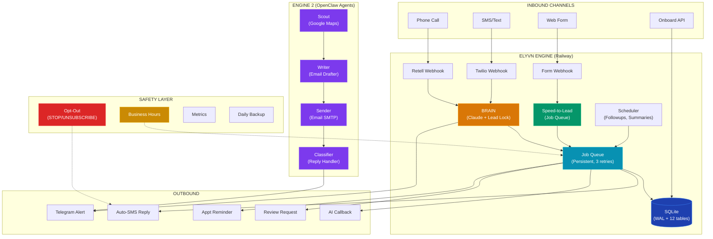
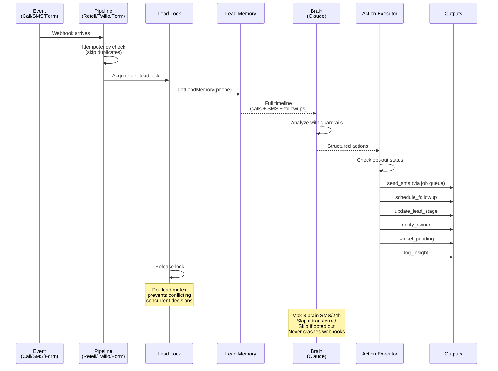
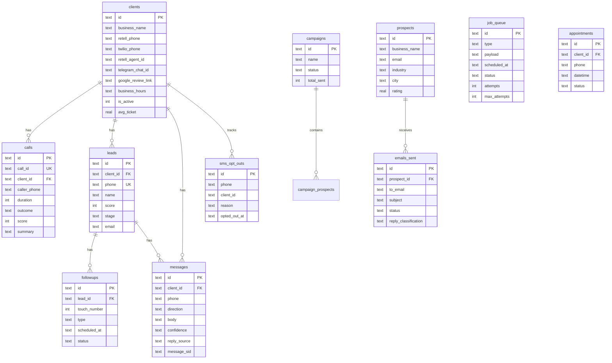

<div align="center">


<br/>


<br/><br/>

[](https://joyful-trust-production.up.railway.app/health)
[]()
[]()
[]()
[]()
[]()
[]()

<br/>

```
 ██████╗ ██╗     ██╗   ██╗██╗   ██╗███╗   ██╗
██╔════╝ ██║     ╚██╗ ██╔╝██║   ██║████╗  ██║
█████╗   ██║      ╚████╔╝ ██║   ██║██╔██╗ ██║
██╔══╝   ██║       ╚██╔╝  ╚██╗ ██╔╝██║╚██╗██║
███████╗ ███████╗   ██║    ╚████╔╝ ██║ ╚████║
╚══════╝ ╚══════╝   ╚═╝    ╚═══╝  ╚═╝  ╚═══╝
```

**AI operations platform for service businesses.**<br/>
Answers every call. Replies to every text. Books every appointment. Markets itself while you sleep.

<br/>

[Live Dashboard](https://joyful-trust-production.up.railway.app) · [Health Check](https://joyful-trust-production.up.railway.app/health) · [API Docs](#api-endpoints) · [Onboarding API](ONBOARDING_API.md) · [Quick Start](QUICK_START.md)

</div>

---

## How It Works

<div align="center">



</div>

---

## Features

<table>
<tr>
<td width="50%">

### Engine 1 — AI Operations


- **AI Call Answering** — Retell handles calls with custom knowledge base, scores leads 1-10, summarizes every call
- **SMS Auto-Reply** — Claude generates contextual replies with confidence scoring and escalation
- **Speed-to-Lead** — Persistent job queue: instant SMS (0s) → AI callback (60s) → follow-up SMS (5min) → 24h/72h nurture
- **Missed Call Text-Back** — Instant SMS when a call is missed or goes to voicemail
- **Voicemail Handling** — Text-back + next-business-hour callback scheduling
- **Web Form Capture** — Universal webhook (WordPress, Typeform, Wix, Squarespace, custom)
- **Appointment Reminders** — Job queue integrated SMS reminders
- **Review Automation** — `/complete` → cancels reminders → review request SMS in 2 hours
- **Cross-Channel Brain** — Per-lead locking prevents conflicting decisions across concurrent events
- **Client Onboarding** — Single API call creates client + generates knowledge base

</td>
<td width="50%">

### Engine 2 — Self-Marketing


- **Scout Agent** — Google Maps scraper across 20 US cities (plumbers, HVAC, auto repair, dentists, electricians)
- **Writer Agent** — Personalized cold emails using business data (rating, reviews, industry stats)
- **Sender Agent** — 30 emails/day via Gmail SMTP with 2-min delays (anti-spam safe)
- **Classifier Agent** — Inbox monitor every 30 min, classifies + auto-responds
- **Telegram Alerts** — Hot replies flagged instantly
- **CAN-SPAM Compliant** — Real sender, unsubscribe in every email, bounced/opted-out never re-emailed

### Production Safety

- **SMS Opt-Out** — STOP/UNSUBSCRIBE/QUIT/END compliance + re-opt-in
- **Business Hours** — Delays sends until client's configured open hours
- **Persistent Job Queue** — Survives restarts, 3 retries, 15s polling
- **Daily Backups** — SQLite WAL checkpoint + file copy
- **Metrics** — `recordMetric()` + `/metrics` endpoint
- **Resilience** — Retry with backoff, circuit breaker pattern

</td>
</tr>
</table>

---

## The Brain

<div align="center">



</div>

**Available Actions:**
| Action | What it does |
|--------|-------------|
| `send_sms` | Send SMS via Twilio (checks opt-out first, logged as `reply_source: 'brain'`) |
| `schedule_followup` | Insert into followups table with timing + content |
| `cancel_pending_followups` | Cancel all pending followups for this lead |
| `update_lead_stage` | Move lead through: `new → contacted → hot → booked → completed → lost` |
| `update_lead_score` | Adjust score 1-10 based on engagement signals |
| `notify_owner` | Send Telegram alert to business owner |
| `log_insight` | Record brain's reasoning for audit trail |
| `no_action` | Explicitly decide to do nothing (logged) |

---

## Speed-to-Lead Engine

<div align="center">

```
Customer submits form / misses call
         │
         ▼
    ┌─────────┐    ┌─────────────────────────────┐
    │  0 sec   │──→ │ 📱 SMS with booking link     │──→ Job Queue
    └────┬────┘    │    (business hours aware)     │
         │         └─────────────────────────────┘
         ▼
    ┌─────────┐    ┌─────────────────────────────┐
    │  60 sec  │──→ │ 📞 AI callback via Retell    │──→ Job Queue
    └────┬────┘    │    (checks lead.stage first)  │
         │         └─────────────────────────────┘
         ▼
    ┌─────────┐    ┌─────────────────────────────┐
    │  5 min   │──→ │ 📱 Follow-up SMS             │──→ Job Queue
    └────┬────┘    │    (if not booked)            │
         │         └─────────────────────────────┘
         ▼
    ┌─────────┐
    │  24 hr   │──→ 📱 Nurture SMS via brain (followups table)
    └────┬────┘
         ▼
    ┌─────────┐
    │  72 hr   │──→ 📱 Final nudge via brain
    └─────────┘
```


</div>

---

## Architecture

<div align="center">

```
┌──────────────────────────────────────────────────────────────────────────┐
│                          RAILWAY (Production)                            │
│                                                                          │
│  ┌─────────────────────────────┐    ┌──────────────────────────────┐    │
│  │    Bridge (Node.js 22)      │    │     MCP Server (Python)      │    │
│  │    Port 3001                │    │     Port 8000                │    │
│  │                             │    │                              │    │
│  │  Webhooks:                  │    │  FastMCP 3.1.1               │    │
│  │  ├── /webhooks/retell    ───┤    │  Tools: voice, messaging,    │    │
│  │  ├── /webhooks/twilio    ───┤    │  followup, booking,          │    │
│  │  ├── /webhooks/telegram  ───┤    │  intelligence, reporting,    │    │
│  │  ├── /webhooks/form      ───┤    │  scraper, outreach,          │    │
│  │  └── /api/*              ───┤    │  reply_handler               │    │
│  │                             │    │                              │    │
│  │  Core Utils:                │    │  Knowledge Bases:            │    │
│  │  ├── brain.js (+ lead lock) │    │  └── Per-client JSON         │    │
│  │  ├── leadMemory.js          │    └──────────────────────────────┘    │
│  │  ├── actionExecutor.js      │                                        │
│  │  ├── speed-to-lead.js       │    ┌──────────────────────────────┐    │
│  │  ├── jobQueue.js            │    │     SQLite (/data/elyvn.db)  │    │
│  │  ├── scheduler.js           │    │     WAL mode | busy_timeout  │    │
│  │  ├── sms.js (+ opt-out)     │    │     12 tables | 6 indexes   │    │
│  │  ├── telegram.js            │    │                              │    │
│  │  └── phone.js (normalize)   │    │  New tables:                 │    │
│  │                             │    │  ├── job_queue (persistent)   │    │
│  │  Safety Utils:              │    │  ├── sms_opt_outs            │    │
│  │  ├── optOut.js              │    │  └── (+ appointments, etc.)  │    │
│  │  ├── businessHours.js       │    └──────────────────────────────┘    │
│  │  ├── metrics.js             │                                        │
│  │  ├── backup.js              │    Volume: /data (persistent)          │
│  │  └── resilience.js          │    Health: GET /health                  │
│  └─────────────────────────────┘    Rate limit: 120 req/min/IP          │
│                                      Backups: Daily                      │
│  ┌─────────────────────────────┐    Jobs: 15s poll, 3 retries           │
│  │  Dashboard (React/Vite)     │                                        │
│  │  Served from /public        │                                        │
│  └─────────────────────────────┘                                        │
└──────────────────────────────────────────────────────────────────────────┘

┌──────────────────────────────────────────────────────────────────────────┐
│                       LOCAL MAC (OpenClaw Agents)                         │
│                                                                          │
│  ┌──────────┐  ┌──────────┐  ┌──────────┐  ┌──────────────────┐        │
│  │  Scout   │  │  Writer  │  │  Sender  │  │    Classifier    │        │
│  │  8 AM    │  │  8:30 AM │  │  10 AM   │  │    Every 30 min  │        │
│  │  Scrape  │→ │  Draft   │→ │  Send    │→ │  Classify+Reply  │        │
│  │  50/day  │  │  emails  │  │  30/day  │  │  Auto-respond    │        │
│  └──────────┘  └──────────┘  └──────────┘  └──────────────────┘        │
└──────────────────────────────────────────────────────────────────────────┘
```

</div>

---

## Project Structure

```
elyvn/
├── server/
│   ├── bridge/                          # Node.js Express server
│   │   ├── index.js                     # Entry, middleware, routes, DB migrations (12 tables)
│   │   ├── routes/
│   │   │   ├── retell.js                # call_started/ended/analyzed, voicemail, transfer, idempotency
│   │   │   ├── twilio.js               # SMS reply, opt-out/opt-in, CANCEL/YES, idempotency
│   │   │   ├── telegram.js             # 15 bot commands + callback buttons
│   │   │   ├── forms.js                # Universal form webhook (CF7, Typeform, generic)
│   │   │   ├── onboard.js              # POST /api/onboard — atomic client creation + KB generation
│   │   │   ├── api.js                  # REST API (clients, calls, leads, messages, followups)
│   │   │   └── outreach.js             # Engine 2 campaign management
│   │   ├── utils/
│   │   │   ├── brain.js                # Claude orchestrator + per-lead mutex lock
│   │   │   ├── leadMemory.js           # Cross-channel timeline (INSERT ON CONFLICT)
│   │   │   ├── actionExecutor.js       # Execute brain decisions (opt-out aware)
│   │   │   ├── speed-to-lead.js        # Job queue powered triple-touch + business hours
│   │   │   ├── jobQueue.js             # Persistent job queue (job_queue table, 3 retries)
│   │   │   ├── phone.js                # Centralized phone normalization
│   │   │   ├── sms.js                  # Twilio SMS (opt-out check, retry with backoff)
│   │   │   ├── telegram.js             # Bot API + notification formatters
│   │   │   ├── scheduler.js            # Cron: summary, report, followups, outreach, jobs
│   │   │   ├── calcom.js               # Cal.com booking integration
│   │   │   ├── optOut.js               # STOP/UNSUBSCRIBE/QUIT/END compliance
│   │   │   ├── businessHours.js        # Per-client business hours delay engine
│   │   │   ├── appointmentReminders.js # Job queue integrated reminders
│   │   │   ├── metrics.js              # recordMetric() + /metrics endpoint
│   │   │   ├── backup.js               # Daily SQLite WAL checkpoint + file copy
│   │   │   ├── resilience.js           # Retry with backoff, circuit breaker
│   │   │   ├── scraper.js              # Google Maps Places API scraper
│   │   │   ├── emailGenerator.js       # Claude cold email generator
│   │   │   ├── emailSender.js          # Nodemailer SMTP with daily limits
│   │   │   └── replyClassifier.js      # Claude reply classifier
│   │   └── public/                     # Built dashboard + embed.js
│   ├── mcp/                            # Python FastMCP server
│   │   ├── main.py                     # MCP entry, tool registration
│   │   ├── db.py                       # SQLite schema (aiosqlite)
│   │   ├── knowledge_bases/            # Client KB files (JSON)
│   │   └── tools/                      # 8 MCP tool modules
│   └── requirements.txt
├── dashboard/                          # React + Vite (builds to bridge/public/)
├── landing/                            # Landing page (index.html)
├── tests/
│   └── hypergrade.js                   # 71-test production suite
├── ONBOARDING_API.md                   # Client onboarding API docs
├── QUICK_START.md                      # Quick start guide
├── Dockerfile                          # Python 3.12 + Node 22
├── railway.toml                        # Railway deployment config
└── package.json                        # Root scripts
```

---

## Database Schema

SQLite with WAL mode, `busy_timeout = 5000`, `foreign_keys = ON`. 12 tables, 6 indexes.



---

## Event Flows

### Inbound Call

```
Retell webhook → POST /webhooks/retell
│
├─ Idempotency: skip if call_id already processed
│
├─ call_started → Insert call record, match client
│
├─ call_ended
│  ├─ 1. Fetch transcript (10s timeout, fallback to payload)
│  ├─ 2. Generate summary (Claude, configurable model)
│  ├─ 3. Score lead 1-10
│  ├─ 4. Determine outcome (booked/transferred/missed/voicemail/info)
│  ├─ 5. Upsert lead (INSERT ON CONFLICT)
│  ├─ 6. Schedule follow-ups
│  ├─ 7. Missed → speed-to-lead (job queue)
│  ├─ 8. Voicemail → text-back + next-business-hour callback
│  ├─ 9. Telegram notification
│  └─ 10. BRAIN (per-lead lock → analyze → execute)
│
├─ call_analyzed → Backfill transcript + summary
│
└─ agent_transfer / dtmf(*) → Live transfer
```

### Inbound SMS

```
Twilio webhook → POST /webhooks/twilio
│
├─ Idempotency: skip duplicate MessageSid
│
├─ STOP/UNSUBSCRIBE/QUIT/END → Opt-out + confirmation
├─ START/SUBSCRIBE → Re-opt-in + welcome
├─ CANCEL → Cancel Cal.com booking
├─ YES → Send booking link
│
└─ Normal message:
   ├─ 1. Check opt-out status
   ├─ 2. Check is_active (paused → log only)
   ├─ 3. Rate limit (5-min cooldown)
   ├─ 4. Load KB (capped at 5000 chars)
   ├─ 5. Claude reply {reply, confidence}
   ├─ 6. Low confidence → escalate
   ├─ 7. Log inbound + outbound
   ├─ 8. Telegram notification
   └─ 9. BRAIN (per-lead lock → actions)
```

### Client Onboarding

```
POST /api/onboard
│
├─ Validate (business_name, owner_name, phone, email, industry, services)
├─ Sanitize all strings (max 500 chars)
├─ Generate UUID
├─ Insert into clients table
├─ Generate knowledge base JSON
├─ Save to knowledge_bases/{client_id}.json
└─ Return complete client record
```

---

## Scheduled Tasks

| Task | Interval | Description |
|------|----------|-------------|
| **Job Queue Processor** | Every 15 sec | Process pending jobs (SMS, callbacks, reminders) |
| Follow-up Processor | Every 5 min | Process due followups through the brain |
| Daily Summary | 7:00 PM IST | Telegram: calls, bookings, messages, revenue |
| Weekly Report | Monday 8 AM | Telegram: weekly performance |
| Daily Lead Review | 9:00 AM | Brain reviews stale leads (2+ days, score >= 5) |
| Daily Outreach | 10:00 AM | Engine 2: send campaign emails |
| Reply Checker | Every 30 min | IMAP inbox scan for cold email replies |
| **Daily Backup** | Every 24h | SQLite WAL checkpoint + file copy |

---

## Telegram Commands

| Command | Description |
|---------|-------------|
| `/start` | Connect account via onboarding |
| `/today` | Today's booked appointments |
| `/stats` | Last 7 days: calls, bookings, missed, messages, revenue |
| `/calls` | Last 5 calls with outcome, score, summary |
| `/leads` | Hot leads (score >= 7, not completed/lost) |
| `/brain` | Last 10 autonomous brain decisions |
| `/pause` | Pause AI (calls ring through, SMS logged only) |
| `/resume` | Resume AI answering |
| `/complete +phone` | Mark job done → cancel reminders → review request in 2h |
| `/setreview URL` | Set Google review link |
| `/outreach` | Engine 2 campaign stats |
| `/scrape industry city` | Trigger Google Maps scrape |
| `/prospects` | View latest scraped prospects |
| `/help` | Show all commands |

---

## Embed Widget

```html
<form id="elyvn-form">
  <input name="name" placeholder="Name" required>
  <input name="phone" placeholder="Phone" required>
  <textarea name="message" placeholder="How can we help?"></textarea>
  <button type="submit">Send</button>
</form>
<script src="https://joyful-trust-production.up.railway.app/embed.js"
        data-client-id="YOUR_CLIENT_ID"></script>
```

---

## Environment Variables

| Variable | Required | Description |
|----------|----------|-------------|
| `ANTHROPIC_API_KEY` | Yes | Claude API (brain, SMS, scoring, summaries) |
| `RETELL_API_KEY` | Yes | Retell API (call transcripts) |
| `TWILIO_ACCOUNT_SID` | Yes | Twilio SID |
| `TWILIO_AUTH_TOKEN` | Yes | Twilio auth |
| `TWILIO_PHONE_NUMBER` | Yes | Twilio number |
| `TELEGRAM_BOT_TOKEN` | Yes | Telegram bot token |
| `TELEGRAM_WEBHOOK_SECRET` | Yes | Webhook verification secret |
| `DATABASE_PATH` | No | SQLite path (default: `/data/elyvn.db`) |
| `CLAUDE_MODEL` | No | Model override (default: `claude-sonnet-4-20250514`) |
| `CALCOM_API_KEY` | No | Cal.com booking management |
| `CALCOM_BOOKING_LINK` | No | Cal.com booking URL for outreach |
| `GOOGLE_MAPS_API_KEY` | No | Google Maps scraping |
| `SMTP_USER` | No | Gmail for outreach |
| `SMTP_PASS` | No | Gmail app password |
| `ELYVN_API_KEY` | No | API auth (open if unset) |

---

## API Endpoints

All `/api` routes require `x-api-key` header when `ELYVN_API_KEY` is set.

| Method | Path | Description |
|--------|------|-------------|
| `GET` | `/health` | DB counts, env vars, memory, uptime, pending jobs |
| `GET` | `/metrics` | Internal metrics (behind API auth) |
| `POST` | `/api/onboard` | Atomic client onboarding (see [ONBOARDING_API.md](ONBOARDING_API.md)) |
| `GET` | `/api/clients` | List all clients (max 100) |
| `POST` | `/api/clients` | Create client |
| `PUT` | `/api/clients/:id` | Update client (UUID validated) |
| `GET` | `/api/calls/:clientId` | List calls (filter: outcome, dates, score) |
| `GET` | `/api/leads/:clientId` | List leads |
| `GET` | `/api/messages/:clientId` | List messages |
| `GET` | `/api/followups/:clientId` | List followups |
| `POST` | `/api/outreach/scrape` | Trigger Google Maps scrape |
| `POST` | `/api/outreach/campaigns` | Create outreach campaign |

---

## Webhook URLs

| Service | URL |
|---------|-----|
| Retell | `https://joyful-trust-production.up.railway.app/webhooks/retell` |
| Twilio SMS | `https://joyful-trust-production.up.railway.app/webhooks/twilio` |
| Telegram | `https://joyful-trust-production.up.railway.app/webhooks/telegram` |
| Web Forms | `https://joyful-trust-production.up.railway.app/webhooks/form/:clientId` |

---

## Security & Hardening


| Category | Protection |
|----------|-----------|
| Process | `unhandledRejection` + `uncaughtException` handlers |
| Routes | Every handler wrapped in try-catch |
| JSON | Express error middleware returns 400, not 500 |
| Database | WAL mode, 5s busy_timeout, UNIQUE indexes, transactions |
| Rate limiting | 120 req/min/IP, 5-min SMS cooldown, 3 brain SMS/24h |
| Auth | API key on `/api`, Telegram webhook secret |
| Idempotency | Retell skips processed call_id, Twilio skips duplicate MessageSid |
| Brain | Per-lead mutex lock prevents concurrent conflicting decisions |
| SMS | Opt-out compliance (STOP/UNSUBSCRIBE/QUIT/END), checked before every send |
| Data | PII stripped from logs, KB capped at 5000 chars |
| Files | UUID validation on file paths, async I/O |
| Network | 10s fetch timeout on external APIs |
| Email | CRLF header sanitization |
| Backups | Daily SQLite WAL checkpoint + file copy |

---

## Deployment

```bash
npm run dev          # MCP + Bridge + Dashboard (local)
npm run build        # Dashboard → server/bridge/public/
railway up --detach  # Deploy to Railway
```

**Railway config:** Health check `GET /health`, restart on_failure (max 3), volume `/data`

---

## Testing

```bash
BASE_URL=https://joyful-trust-production.up.railway.app node tests/hypergrade.js
```

71 tests: infrastructure, Retell pipeline, missed call, SMS + brain, speed-to-lead, forms (7 variants), Telegram (15 commands), concurrency (10 calls + 15 SMS + 5 forms + multi-channel), malformed attacks (SQL injection, XSS, 50KB, emoji flood, null bytes, negative values), full E2E flow, agent files, embed, auth.

---

## Post-Max Survival

```bash
# One env var change — 12x cheaper
CLAUDE_MODEL=claude-haiku-4-5-20251001
```

| Item | Cost |
|------|------|
| Railway | $5/mo |
| Claude Haiku API | $5-15/mo |
| OpenClaw agents (NVIDIA free tier) | $0/mo |
| Twilio/Retell (client pass-through) | $0 |
| **Total** | **$10-20/mo** |

---

<div align="center">


<br/><br/>

[](https://github.com/sweetsinai/elyvn)

</div>
